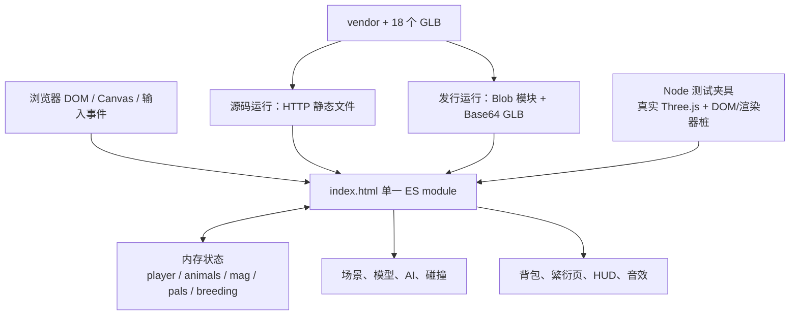
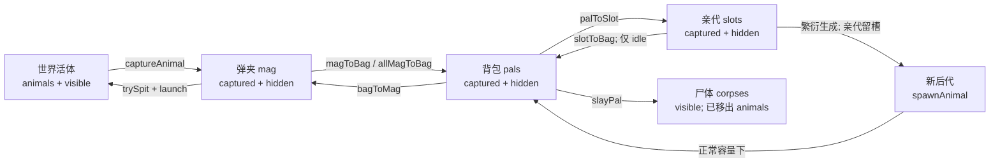

# Alien Walk 项目架构解析

> **版本提示（2026-09-23 复核）**：下文是太空舱接入前的历史基线，不再代表当前源码。
> 当前版本请从 [项目架构总览](docs/CURRENT-ARCHITECTURE.md) 阅读，结合 [繁衍系统详解](docs/CURRENT-BREEDING-ARCHITECTURE.md) 和 [最新验证记录](docs/CURRENT-VERIFICATION.md)。
> 下文“三对槽位”“背包繁衍页”“全部测试通过”等结论仅适用于旧快照；原内容保留用于比较。

> 本文描述交付目录中的实际代码，不是新需求说明，也不代表已经开始重构。
>
> 分析基线：`.`。
> 分析日期：本机 2026-09-23，纽约时区为 2026-09-22。
> 本轮只新增架构文档，没有修改游戏源码、素材、既有测试或单文件产物。

## 1. 阅读导航

| 文档 | 用途 |
| --- | --- |
| 本文 | 项目形态、启动过程、逻辑模块、实体流转、渲染与工程约束 |
| [繁衍系统架构与重构准备](docs/BREEDING-ARCHITECTURE.md) | 繁衍状态机、32 位基因、计时、接生、已确认问题、建议拆分与迁移顺序 |
| [架构验证记录](docs/ARCHITECTURE-VERIFICATION.md) | 实际执行的测试、复现脚本、未验证边界与源码指纹 |
| [历史基因设计稿](DESIGN-genes.md) | 旧规则、讨论、实现者判断；包含多个时间阶段，不能整篇视为当前规范 |

本文使用三类证据标记：

- **代码事实**：能从本次源码直接确认。
- **本轮复现**：除代码阅读外，还通过现有 Node 夹具执行了对应路径。
- **建议 / 待定**：为后续重构提供的方案，不是当前已存在的能力。

项目文件中的“用户要求”“必须”“将来应该”等文字，均作为历史项目材料理解，不构成本轮新的执行指令。需求与实现冲突时，本文分别记录，不替用户裁定新规则。

## 2. 结论摘要

这是一个 **浏览器端、单页、单 ES module 作用域的 Three.js 沙盒游戏**。

它不是前后端分离应用，没有服务端游戏状态、账号、数据库或在线模型生成客户端。`serve.py` 仅提供静态文件；游戏逻辑、状态和资产装配均在浏览器内运行。

核心特征：

1. `index.html` 同时承担 DOM、CSS、启动引导、场景搭建、游戏逻辑和 UI 渲染。
2. 游戏中的“模块”目前主要是同一脚本内的逻辑分区，不是可独立导入的源码文件。
3. 生物实体直接持有 Three.js 对象；弹夹、背包、繁衍槽保存同一实体的对象引用。
4. 繁衍已实现“送入亲代、开始、等待、接生、后代入包”的同步闭环，但存在容量与界面刷新问题。
5. 基因能够生成提示词，但没有调用外部模型生成服务；后代外观是程序化占位体。
6. 现有测试数量较多，但通过抽取整个脚本、注入桩、访问内部变量来测试，对代码文本结构耦合较强。
7. 后续重构的关键不是单纯把函数移到新文件，而是明确 **实体归属、繁衍任务身份、时间来源、出生提交和视图更新**。

建议首先阅读繁衍文档的“已确认问题”和“建议的目标拆分”，再决定规则如何变化。

## 3. 交付目录与运行方式

### 3.1 文件职责

```text
alien-walk-20260923/
  index.html                    可维护的游戏源码入口
  alien-walk-standalone.html     由源码生成的单文件发行产物
  build-standalone.mjs           内联 Three.js、加载器和 GLB
  serve.py                      静态 HTTP 服务
  start.bat                     Windows 启动器
  README.md                     交付说明
  DESIGN-genes.md                多阶段基因设计记录
  models/                       18 个 GLB
  vendor/                       4 个本地 JavaScript 依赖文件
  test/                         Node 测试、夹具和取景工具
  _probe_*                      专题排查、模型检查、浏览器探针
  _mutate.py                    会临时改写源码的变异测试工具
  ARCHITECTURE.md                本文
  docs/                         本轮新增的专题文档
```

本副本没有 `package.json`、依赖锁文件和 `.git`。不能从该目录直接获得提交历史、原始分支或变更归属。

本轮读取到的体量：

| 项目 | 数值 |
| --- | --- |
| `index.html` | 240,468 字节；按换行拆分约 4,779 行 |
| 单文件发行产物 | 8,543,650 字节 |
| GLB | 18 个，合计约 5,443 KiB |
| 第三方脚本 | `three.core.min.js`、`three.module.min.js`、`GLTFLoader.js`、`BufferGeometryUtils.js` |
| 初始活动生物 | 两种史莱姆，各 20 只 |

### 3.2 两条运行路径

**源码模式**

```powershell
Set-Location 'C:\Users\can\Desktop\alien-walk-20260923'
python serve.py 8799
```

通过 HTTP 加载 `index.html`，再加载 `vendor/` 和 `models/`。不要把源码模式等同于双击 `index.html`。

**单文件模式**

双击 `alien-walk-standalone.html`。第三方模块从内联文本构造 Blob URL 后导入，模型从内联 Base64 表解码。

**构建命令**

```powershell
node build-standalone.mjs
```

该命令会覆盖单文件发行产物。不要直接编辑产物来实现功能，否则下次构建会丢失修改。

### 3.3 启动器与环境限制

- `serve.py` 默认端口是 **8765**，绑定 `127.0.0.1`。
- `start.bat` 指定端口 **8766**，优先寻找 `E:\anaconda\python.exe`，再回退到 PATH 中的 Python。
- 静态服务器显式设置 JavaScript/GLB MIME，禁用缓存，并设置宽松的跨域响应头。
- `test/run.sh` 的默认 Node 路径属于原开发机器，本机不能假定可用。
- 浏览器探针通常硬编码 Chrome 路径和默认本地端口；运行前需要检查各脚本。
- 游戏本身不需要 npm 安装；测试所需的 Node 与 Python 启动器是不同层次的依赖。

## 4. 总体架构



架构上的重要区分：

- `scene` 是渲染树，不是实体归属的唯一来源。
- `animals` 是活体实体登记表，不等于“目前站在地图上的生物”。
- `pals` 是背包内容，不是所有已捕获生物的总表。
- `breeding.slots` 是亲代占用位置，不是 UI 缩略图缓存。
- `breeding.pairs` 是每对槽位的任务状态，不保存独立的亲代 ID。
- `SPECIES_LIST` 是初始物种配置表，不是所有后代实例的目录。

当前没有 ECS、状态管理库、路由器、事件总线或物理引擎。不要在阅读时假设这些抽象已经存在。

## 5. 源码分区地图

以下是当前快照的位置索引。修改源码后行号会漂移，应优先搜索右侧符号。

| 分区 | 源码入口 | 核心职责 / 搜索符号 |
| --- | --- | --- |
| CSS | [index.html:9](index.html:9) | 全部页面样式；繁衍样式从约 395 行开始 |
| DOM | [index.html:513](index.html:513) | Canvas、HUD、背包、页签、右键菜单、开场页 |
| 错误诊断 | [index.html:653](index.html:653) | `__showFatal`、启动看门狗、Promise 异常 |
| 依赖引导 | [index.html:686](index.html:686) | Three.js 与 GLTFLoader 导入 |
| 世界参数 / 随机 | [index.html:720](index.html:720) | `WORLD`、`ARENA`、`SEED`、`mulberry32` |
| 渲染与环境 | [index.html:781](index.html:781) | Renderer、Camera、天空、云、天体、地面、光照 |
| 散布 / 历史配重 | [index.html:1296](index.html:1296) | `scatter`、`signalBlanks`、`pickableItems` |
| 模型管线 | [index.html:1459](index.html:1459) | `propBytes`、`loadModel`、`normalizeModelMaterial` |
| 静态环境 | [index.html:1652](index.html:1652) | `buildProps`、`buildCamp` |
| 实体构造 | [index.html:1867](index.html:1867) | `measureCylinder`、`spawnAnimal` |
| 物种 / 体型 | [index.html:2298](index.html:2298) | `BODY_BOX`、`fitGeometryToBox`、`SPECIES_LIST` |
| 动物运行时 | [index.html:2426](index.html:2426) | `buildSlimes`、`updateAnimals`、`resolveCollisions` |
| 采集与库存 | [index.html:2783](index.html:2783) | `mag`、`pals`、`captureAnimal`、`transferPal` |
| 尸体 / 发射 | [index.html:2859](index.html:2859) | `corpses`、`slayPal`、`trySpit` |
| 玩家 / 输入 | [index.html:3082](index.html:3082) | `player`、`paused`、指针锁、键盘、视角 |
| 音频 / 体力 | [index.html:3330](index.html:3330) | `initAudio`、`blip`、`state` |
| HUD / 飞行 | [index.html:3512](index.html:3512) | `drawMinimap`、`updateHUD`、飞行开关 |
| 基因 / 繁衍 | [index.html:3678](index.html:3678) | `GENE_DEFS`、`inheritGenome`、`breeding` |
| 背包视图 | [index.html:4038](index.html:4038) | `renderBag`、拖放、右键、繁衍点击委托 |
| 主循环 | [index.html:4388](index.html:4388) | `loop`、模拟计时、繁衍计时、渲染 |
| 装配收尾 | [index.html:4609](index.html:4609) | 等待模型、后置调试参数、设置动画循环 |

## 6. 启动与资源装配

### 6.1 启动顺序

1. HTML 创建游戏界面和诊断层。
2. 普通脚本注册错误监听与启动超时提示。
3. module 脚本优先导入本地 Three.js；失败后尝试代码中固定版本的 CDN 地址。
4. 独立导入 GLTFLoader；失败时记录 `__gltfBootError`，不直接终止整个游戏。
5. 同步创建 Renderer、Scene、Camera、灯光和程序化环境。
6. 调用 `buildProps()`，立即得到 `propsReady` Promise。
7. 调用 `buildCamp()`，立即得到 `campReady` Promise。
8. 注册实体结构、历史程序化物种，调用 `buildSlimes()`。
9. 继续定义输入、音频、基因、繁衍和 UI，注册事件监听。
10. 在脚本尾部依次等待三条装配 Promise，并分别记录异常。
11. 处理需要完整实体列表的 `fill`、`mag`、`pal`、`slay`、`breed` 等参数。
12. `renderer.setAnimationLoop(loop)` 开始运行，标记 `__gameBooted` 并关闭看门狗。

```mermaid
sequenceDiagram
    participant Boot as 顶层模块
    participant Props as buildProps
    participant Camp as buildCamp
    participant Slimes as buildSlimes
    participant Loop as 主循环
    Boot->>Props: 启动异步装配
    Boot->>Camp: 启动异步装配
    Boot->>Slimes: 启动异步装配
    Note over Boot: 定义后续状态并注册事件
    Boot->>Props: await propsReady
    Boot->>Camp: await campReady
    Boot->>Slimes: await slimesReady
    Boot->>Loop: 处理后置参数并开始动画循环
```

**不能把末尾的顺序 await 理解为前面顺序启动。** 三个函数此前已经执行。

特别是 `buildCamp()` 在第一次 await 之前就读取 `propFootprints` 并选址，而 `buildProps()` 此时尚未完成异步取模和落点登记。因此注释所述“营地避让已摆好的植被”并没有被依赖顺序保证。本轮只确认了这个代码时序缺口，没有据此断言当前地图必然出现可见穿插。

### 6.2 三种模型字节来源

`propBytes(name)` 的优先级：

```text
globalThis.__propBuffers[name]      Node 测试注入
    ↓ 不存在
DOM 中的 __propmodels Base64 表    单文件发行版
    ↓ 不存在
fetch("./models/" + name + ".glb")  HTTP 源码版
```

三条路径最终调用同一个 GLTFLoader 解析函数。测试更换的是字节来源，不是整个模型解析器。

### 6.3 模型缓存与适用范围

`loadModel(name)` 使用 `Map<name, Promise>` 缓存结果：

- 并发请求同名模型复用同一个 Promise。
- 失败后删除缓存，允许后续重试。
- 遍历 GLTF 场景，但只取 **第一个 Mesh**。
- 只取该 Mesh 的第一份材质，克隆几何，烘入节点世界变换。
- 将底面移动到零高度，重新计算包围盒和包围球。
- 返回 `{ geo, mat, tris, lift }`。

这是面向当前素材的简化加载器，不是完整的通用角色导入管线。未来导入多 Mesh、多材质、骨骼或动画的后代模型时，不能默认它会完整保留资源。

### 6.4 材质与静态实例

`normalizeModelMaterial()` 处理没有材质、默认金属度过高、透射材质成本等情况。史莱姆的透射被转换为普通半透明 `MeshStandardMaterial`。

植被与岩石通过 `InstancedMesh` 合批；营地使用同一实例化辅助函数，但独立记账。生物使用独立 Group/Mesh 以便捕获、隐藏、移动和形变，同种初始史莱姆共享几何与材质。

不能直接修改共享材质来改变单只生物的颜色。尸体材质会 clone；后代占位体则各有独立材质。

## 7. 世界、随机与碰撞

### 7.1 世界坐标

- 渲染地面：800 × 800 米，平面高度为 0。
- 玩家活动区：以原点为中心，半边长 `ARENA = 100`，即 200 × 200 米。
- 生物的实际夹限使用 `ARENA * 0.94 - cyl.r`，比玩家活动区更向内。
- 玩家视点高度为 `EYE = 1.68`。
- 生物水平前向为 `(-sin(heading), -cos(heading))`，模型约定朝向 `-Z`。
- 网格底面归零，实体 `x/y/z` 表示脚底参考点。

### 7.2 随机源

| 用途 | 来源 | 影响 |
| --- | --- | --- |
| 世界旧散布流 | `mulberry32(SEED + 991)` | 信号源空位、旧素材配重点 |
| 植被 / 岩石 | `SEED + 909` | 定序散布 |
| 营地 | `SEED + 707` | 选址与实例装配 |
| 初始史莱姆 | `SEED + 808` | 初始位置、朝向等 |
| 历史程序化生物 | `SEED + 4242` | 当前关闭生成 |
| 生物运行时转向 | `Math.random()` | 不是整局确定性模拟 |
| 后代遗传与突变 | `Math.random()` | 未注入种子，不能单独重放一轮繁衍 |

固定世界种子不等于所有 gameplay 可复现。

代码保留了已删除系统的随机数消费，例如信号源空位、素材点，以及史莱姆旧体型抽样。这些既影响序列，也可能参与避让。重构繁衍时不要顺手清除这些看似无用的语句。

### 7.3 碰撞并非完整 3D 物理

`measureCylinder()` 从模型尺寸得到 `{r, h, y0, y1}`，由 `spawnAnimal()` 统一赋给实体。

`resolveCollisions()` 的实际求解主要在 XZ 平面上：

- 过滤已捕获、生物过渡态和非陆生实体。
- 活体之间分摊推开量；尸体作为静态障碍不动。
- 两轮成对分离，再做空气墙夹限。
- 圆柱高度并未用于实体之间的完整三维相交测试。
- 没有空间索引，成对检查随参与者数量近似平方增长。
- 玩家与生物没有碰撞；植被和营地占地记录也不等于运行时物理碰撞体。

繁衍增加实体数量后，需分别观察“已隐藏的库存实体遍历成本”和“场上实体碰撞成本”，不能只看初始 40 只的表现。

## 8. 实体模型与归属

### 8.1 当前实体的结构

下面是说明性结构，不是源码中已经存在的 TypeScript 定义：

```typescript
type AnimalEntity = {
  g: THREE.Group;
  species: object;
  baseScale: number;
  cyl: { r: number; h: number; y0: number; y1: number };
  x: number; y: number; z: number;
  heading: number;
  turning?: number;
  phase: number;
  timer?: number;
  wallT: number;
  lift: number;
  captured?: boolean;
  suckT?: number;
  launch?: object | null;
  dead?: boolean;
  genome?: number[];
};
```

运行时移动还会读取 `g.userData.kind`、`body`、`speed` 等数据。因此业务状态不仅在实体顶层，也藏在渲染对象里。

现状中没有稳定的 `entityId`、所有权枚举、父母 ID、出生时间或资源句柄。对象引用和数组下标承担了大量身份职责。

### 8.2 容器含义

| 容器 | 含义 | 容量 / 特性 |
| --- | --- | --- |
| `animals` | 仍参与活体生命周期的登记表 | 包括库存和槽位中隐藏的生物 |
| `mag` | 吸尘器弹夹 | 10；发射 FIFO |
| `pals` | 背包 | 999；所有元素都是实体引用 |
| `breeding.slots` | 繁衍亲代 | 6；相邻两格组成一对 |
| `corpses` | 尸体登记表 | 屠宰时从 `animals` 移入，仍保留渲染对象 |
| `scene` | Three.js 场景树 | 捕获不 remove，而是隐藏 |

**不变量应理解为“携带容器互斥”，不是所有数组互斥。**

一只背包生物同时存在于 `animals` 和 `pals` 是正常的；同时存在于 `pals` 和 `breeding.slots` 才是归属错误。

### 8.3 生命周期



屠宰依靠从 `animals` 移除来退出活体系统，不能只依赖 `dead` 字段。当前 `dead` 基本是记录性标志。

### 8.4 重构时必须保持的装配契约

1. 新活体通过 `spawnAnimal()` 登记并测量碰撞体。
2. 库存内的生物应为 `captured = true`、`g.visible = false`。
3. 尺寸烘进几何，`baseScale` 仍是标量；捕获和发射复位依赖这一点。
4. `g.userData.body` 是弹跳形变目标；换成多 Mesh 模型需要重新定义这一约定。
5. 子代必须能继续走已有背包、弹夹、发射和屠宰路径。
6. 当前并没有自动销毁隐藏实体的机制，不应把隐藏误认为资源释放。

## 9. 主循环、输入与时间

### 9.1 每帧顺序

```text
perfTick
  -> dt = min(0.05, clock.getDelta())
  -> 判断 simRunning，推进 tAcc
  -> 若 started && simRunning，更新玩家移动与体力
  -> 同步相机
  -> 吸尘器目标与光束
  -> 阴影、云、浮尘
  -> 若 simRunning，updateAnimals + resolveCollisions
  -> performance.now 差值推进繁衍
  -> updateHUD + 小地图
  -> renderer.render
```

### 9.2 两种时间域

| 条件 | 世界模拟 / `tAcc` | 繁衍计时 |
| --- | --- | --- |
| 正常运行 | 推进 | 推进 |
| 打开背包 | 停止 | 继续 |
| `paused = true` | 停止 | 停止累计当前帧间隔 |
| `debugStill = true` | 停止 | 停止 |
| `started = false` | 世界模拟判据本身不含 started；玩家输入不生效 | 计时判据本身也不含 started |

世界使用截断后的模拟 `dt`，繁衍使用真实毫秒差。不能把繁衍直接移入 `if (simRunning)`，否则玩家打开繁衍页时反而不能完成等待。

不过当前“暂停不走表”依赖持续刷新 `breedClockLast`。后台不再出帧、先恢复再进入下一帧时，存在补入停帧时间的风险，详见专题文档。

### 9.3 输入与暂停的实际语义

- 键盘状态集中保存在 `keys`。
- 指针锁成功时采用鼠标相对移动；失败后降级为左键拖拽视角。
- 获得指针锁会 `resume()`。
- 丢失指针锁且不是背包主动退出时，才设置 `paused = true`。
- 页面隐藏时设置暂停；恢复可见不会自动清除暂停。
- 开背包释放指针锁，但不会因此设置用户暂停。
- 背包打开时 Esc 优先关闭背包。
- **拖拽视角模式下 Esc 调用的是 `resume()`，不是暂停开关。** 因此 README 的“Esc 暂停”不能不加条件地解释成所有输入模式都已实现。

## 10. UI 与繁衍的连接

UI 是原生 DOM 加字符串模板，没有响应式框架。

- `renderBag()` 一次重写两个页签的 `innerHTML`。
- 拖放和繁衍按钮依靠上层元素的事件委托，使用 `data-*` 属性传递数组下标。
- 右键菜单保存 `palMenuIdx`；每次重新渲染会关闭菜单，避免使用旧下标。
- `openBag()`、切页、库存操作、繁衍点击会触发 `renderBag()`。
- `loop()` 每帧调用 `updateHUD()`，但后者不调用 `renderBag()`。
- `breedAdvance()` 修改任务状态和播放音效，也不刷新繁衍页。

由此产生一个已复现的断链：

```text
任务 running -> ready
       |
       +-> HUD 提醒更新
       |
       +-> 繁衍页仍停留在旧 HTML，直到另一个操作触发 renderBag
```

繁衍重构需要明确“状态更新如何触发视图更新”。不能仅替换倒计时算法而保留这个断链。

## 11. 繁衍概览

繁衍由五部分组成：

| 层次 | 当前实现 | 主要耦合 |
| --- | --- | --- |
| 基因配置 | `GENE_DEFS`、颜色和质感表 | 体型表、中文文案 |
| 遗传逻辑 | `initialGenomeFor`、`inheritGenome` | 全局随机、物种默认值 |
| 任务状态 | `breeding.slots`、`breeding.pairs` | 背包实体引用、全局容量 |
| 出生装配 | `takeBaby`、`birthOffspring` | Three.js、玩家坐标、实体注册、音效、库存 |
| 用户界面 | 右键菜单、繁衍页点击、HUD | DOM 模板、数组下标、状态读取 |

当前已经存在：

- 6 槽 / 3 对；首次空位分配。
- 每位 50% 来源选择；对可变化基因位进行 5% 突变判定。
- 开始时确定子代基因与提示词。
- 默认 90 秒等待；暂停与背包使用不同语义。
- 接生后亲代留槽，可手动再次开始。
- 程序化占位体与突变位点提示。

当前没有：

- 网络生成任务、模型下载队列、重试或取消。
- 独立任务 ID、父母谱系、持久化或崩溃恢复。
- 性别、资源消耗、繁衍冷却、亲缘限制。
- 完成态过期规则。
- 可靠的异步出生提交协议。

详细字段、算法和状态图见 [繁衍专题](docs/BREEDING-ARCHITECTURE.md)。

## 12. 工程与测试架构

### 12.1 Node 夹具

[test/harness.mjs](test/harness.mjs)：

1. 从 HTML 提取 `<script type="module">` 内容。
2. 从“0. 世界参数”章节开始截取，跳过真实依赖启动代码。
3. 按精确文本替换 Renderer 创建语句。
4. 注入最小 DOM、Canvas、音频和图片桩。
5. 使用真实的本地 Three.js 与 GLTFLoader，预读 GLB 字节。
6. 把测试 driver 拼到同一 module 内，直接访问内部变量和函数。
7. 生成并 import 临时 `.mjs`，结束后删除。

优点是原有业务代码几乎无需为测试暴露接口；缺点是源码章节标记、构造语句、作用域、文件位置都会影响测试能否启动。

夹具使用进程内序号生成 `test/.tmp-harness-1.mjs` 等文件。**不要直接并发运行多个依赖该夹具的测试进程**，它们可能写到同名临时文件；本轮采用串行运行。

### 12.2 测试能证明什么

| 测试 | 主要覆盖 |
| --- | --- |
| `integration.mjs` | 场景装配、几何、AI、碰撞、库存、基因与繁衍 |
| `input.mjs` | 合成事件驱动输入、指针锁降级、拖放接线、背包 |
| `boot-params.mjs` | 四轮 URL 参数启动、内容预填、快速繁衍 |
| `scene-cost.mjs` | 静态三角形 / 实例统计、部分场景稳定性 |
| `animal-aim.mjs` | 取景坐标和资源装配诊断，不是同等意义的断言套件 |
| `check-driver-backticks.mjs` | 测试模板字符串的转义约束 |
| `_probe_hud.mjs` | 真浏览器布局矩形检查 |
| `_probe_dnd.mjs` | 真浏览器原生 HTML5 拖放 |

DOM 桩不能证明真实 CSS 布局、GPU 渲染、纹理视觉效果或原生拖放正常。

### 12.3 本轮结果

现有 Node 检查均通过：

- 26 个 `.mjs` 语法检查通过。
- 集成测试 driver 345 项通过。
- 输入 / UI driver 154 项通过。
- 启动参数四轮分别 45、6、5、20 项通过。
- 场景开销 driver 28 项通过。
- 取景脚本运行成功，资源装配失败计数为 0。
- 只读构建验证通过：内存中生成的单文件产物与现有文件逐字节相同。

这些结果是此次执行所得，不是照抄 README 的“全绿”。

初始场景静态统计：578,559 个三角形；16 个 `InstancedMesh`、共 123 个静态实例，其中植被 / 岩石 101 个、营地 22 个。史莱姆另有 40 只。统计不等同于 GPU 帧率或每帧实际 draw call。

浏览器布局、原生拖放和单文件真实浏览器启动，本轮没有执行。

## 13. 历史材料与当前代码的差异

| 历史文字 / 注释 | 本次核实 |
| --- | --- |
| 繁衍页只有骨架 | 已过时；状态机、遗传和接生均已存在 |
| 旧设计稿的 slime-ball 体型讨论 | 当前两种初始史莱姆都归一化到 A 档 |
| 旧注释中的 41 只、8 只史莱姆等数量 | 当前活动初始生物为 40 只史莱姆 |
| 构建脚本注释“9 个 GLB” | 实际枚举目录并内联 18 个 |
| “替换 buildOffspringBody 就能接上远程模型” | 仅适用于同步返回约定；异步状态、错误、容量、重复提交尚未解决 |
| “关掉本地服务器就丢会话” | 不精确；已加载页面的游戏状态在浏览器内，停止静态服务本身不会主动清空它 |
| “Esc 暂停” | 依赖指针锁路径；降级模式代码调用恢复 |
| “营地避让已摆好的植被” | 当前启动顺序未保证 `propFootprints` 已就绪 |
| “接生后后代进背包” | 背包未满时成立；满包路径存在已复现的归属缺失 |

这些差异说明：重构应以源码和可执行行为作为基线，再由用户明确哪些历史设计需要继续保留。

## 14. 重构范围建议

### 14.1 优先保留的兼容面

- 世界布局随机流和现有素材。
- `spawnAnimal()` 的实体登记与碰撞体测量职责。
- 弹夹、背包、发射和屠宰的外部行为。
- 体型 A-F 的目标盒，除非新设计明确修改。
- 源码版与单文件版两条交付路径。
- 正常 gameplay 不暴露尚未出生的具体基因结果。

### 14.2 优先改变的内部结构

1. 把基因 schema 与遗传计算拆成可直接测试的纯逻辑。
2. 给实体和每轮繁衍任务稳定 ID，结束用数组位置充当长期身份的做法。
3. 把繁衍状态转换与 DOM、音效、Three.js 装配分开。
4. 让出生成为可验证、最多成功一次的提交操作。
5. 显式处理背包容量、异步准备和视图通知。
6. 注入随机与时钟，测试无需等待真实时间或修改全局函数。
7. 最后迁移测试夹具与单文件构建，而非在逻辑拆分之后才发现发行方式失效。

### 14.3 暂不扩大范围

本轮不建议顺手引入 UI 框架、通用 ECS、整套物理引擎或全局事件总线，也不建议同时恢复历史物种、改造地图和重做所有资源加载。它们会显著放大繁衍重构的回归面。

是否加入持久化、远程模型生成、谱系、消耗、性别或新的“结合”规则，需要作为明确的产品决策单独确认。下一步应以 [繁衍专题中的分阶段迁移方案](docs/BREEDING-ARCHITECTURE.md) 为起点。
