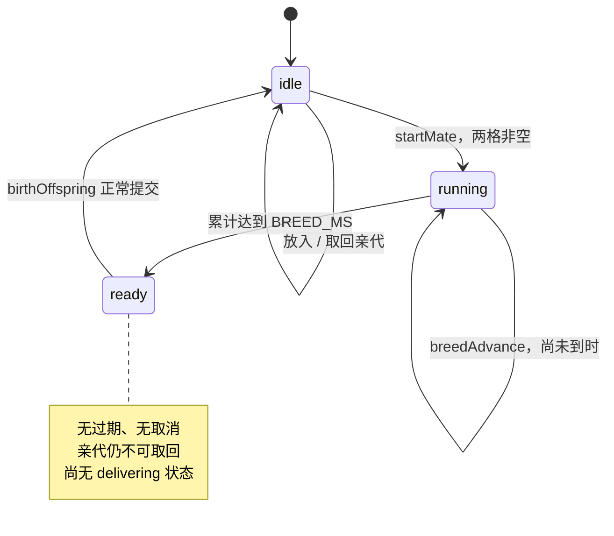
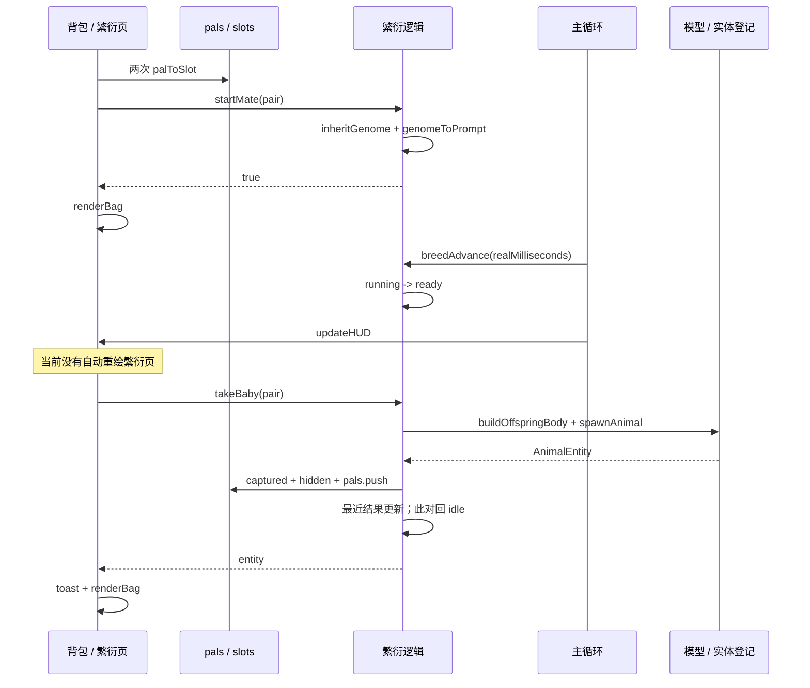

# 结合 / 繁衍系统架构与重构准备

> **历史基线**：这是太空舱接入前的分析。2026-09-23 核对发现，当前源码已采用单舱、两亲代槽和独立演出模块。
> 现行说明见 [CURRENT-BREEDING-ARCHITECTURE.md](docs/CURRENT-BREEDING-ARCHITECTURE.md)。本页旧缺陷和旧测试结果不得直接当作当前结论。

> 配套总览：[项目架构解析](ARCHITECTURE.md)。
> 分析对象是当前交付快照；本文件中的目标结构均为建议，没有实现。
>
> 本文将用户所说的“结合（繁衍）系统”对应到现有代码中的 `breeding`、`startMate`、基因遗传和出生流程。当前代码没有另一套独立的“结合”系统，也没有“结合会消耗 / 合并亲代”的规则；如果后续含义变化，需要先重新定义。

## 1. 系统边界

现有繁衍不是独立模块文件，而是横跨 `index.html` 多个区域的功能：

```text
物种 / 体型配置
    -> 初始基因
背包实体
    -> 右键菜单
    -> 亲代槽位
    -> 开始繁衍
        -> 逐位遗传与突变
        -> 生成提示词
        -> 真实时间累计
    -> 可以接生
        -> 可选动画回调
        -> 创建占位体
        -> 注册实体与碰撞体
        -> 放入背包
        -> 展示突变位点
```

其依赖面包括：

| 依赖 | 直接读取 / 调用 | 原因 |
| --- | --- | --- |
| 物种配置 | `a.species`、`BODY_GRADES`、`BODY_BOX` | 初始基因、体型、速度 |
| 库存 | `pals`、`BAG_MAX` | 移入亲代、退回亲代、收下后代 |
| Three.js | 几何、材质、Group | 创建后代外观 |
| 实体运行时 | `spawnAnimal()` | 碰撞体、场景和 `animals` 登记 |
| 玩家状态 | `player.x/z/yaw` | 后代初始位置与朝向 |
| 随机 | `Math.random()` | 遗传与突变 |
| 时钟 | `performance.now()`、`loop()` | 90 秒累计 |
| UI | `renderBag()`、`updateHUD()`、`showToast()` | 命令入口、进度与结果 |
| 音频 | `blip()`、`setTimeout()` | 开始、完成、接生反馈 |

没有外部生成服务、存储层或异步任务管理器。

## 2. 现行规则与规则来源

### 2.1 当前可执行规则

| 项目 | 当前行为 |
| --- | --- |
| 亲代数量 | 每轮两只 |
| 并行数量 | 固定 3 对，每对独立 |
| 槽位 | 6 格，`0/1`、`2/3`、`4/5` |
| 进入方式 | 背包右键“送去交配”，进入全局第一个空位 |
| 指定槽位 | 当前没有指定目标槽或交换两槽的命令 |
| 单体重复占槽 | 正常调用路径通过从背包移出防止 |
| 性别 / 物种限制 | 无检查；两只在位即可 |
| 开始条件 | 此对 `idle`，且两格均非空 |
| 后代基因确定时机 | 点击交配时，不是接生时 |
| 默认等待 | 90,000 毫秒 |
| 开背包 | 世界停止，繁衍继续 |
| 用户暂停 / 截图冻结 | 当前帧不累计繁衍时间 |
| 等待完成 | `ready`，等待手动接生，不自动入包 |
| 未接生期间 | 没有过期计时，没有自动取消 |
| 亲代退出 | 仅此对 `idle` 且背包未满 |
| 接生后 | 亲代仍在槽位，此对回 `idle`，不自动继续 |
| 后代去向 | 背包；满包存在实现缺陷，见第 9 节 |
| 成本 / 冷却 | 当前没有 |
| 刷新恢复 | 当前没有 |

`ready` 并不是空闲：即使倒计时已经结束，也不能把亲代放回背包。界面的“交配进行中 · 不能放回”涵盖了 `running` 和 `ready` 两种状态。

### 2.2 不应默认为用户永久确认的规则

旧文档明确把下列内容标为实现者的选择或解释：

- 50% 来源采用逐基因位独立二选一，而非整段重组。
- 突变必须抽到与继承值不同的选项。
- 初始两种史莱姆的基因默认值。
- 有无为“无”时保留颜色 / 形态基因，只是不写入提示词。
- 暂无性别限制。
- 忙碌时禁止亲代退出。
- 占位材质的数值映射。
- 后代速度采用亲代物种速度均值。
- 后代名称采用主体形态的中文值。
- 送入槽位后不自动切页。

本轮没有把这些历史选择升级为新需求。重构前可以保留兼容，也可以由新规则明确替换。

## 3. 数据模型

### 3.1 基因：位置型整数数组

```typescript
// 描述当前数据，不是实际源码中的类型声明。
type Genome = number[]; // 长度 32，每个数是该位 opts 的下标

type GeneDefinition = {
  n: number;      // 文档编号，从 1 开始
  key: string;    // 程序查找键
  say: string;    // 突变提示中的位点名
  opts: string[];
};
```

三种编号不要混淆：

```text
GENE_DEFS[0]       -> 文档第 1 位 skeleton
genome[0] = 0      -> skeleton 的第 0 个选项
GENE_DEFS[i].n     -> i + 1
```

数组没有版本号、长度校验、整数校验或选项范围校验。当前内部生产路径生成合法数据；未来导入存档或网络输入后，这个前提不再自动成立。

### 3.2 槽位与任务

```typescript
type PairState = {
  state: "idle" | "running" | "ready";
  ms: number;                 // 已累计的毫秒，不是剩余毫秒
  genome: number[] | null;     // 本轮预定的子代基因
  mutations: GeneDefinition[];
  prompt: string;
};

type BreedingState = {
  slots: (AnimalEntity | null)[]; // 6
  pairs: PairState[];             // 3
  result: null | {
    mutations: GeneDefinition[];
    name: string;
    prompt: string;
  };
};
```

关键含义：

- 槽位保存实体引用，不是副本或 ID。
- `PairState` 不保存父母快照，通过自身下标映射到当前槽位。
- `mutations` 保存整份基因定义对象的引用，不是变化前后值或稳定 key 列表。
- `result` 是全局最近一次结果，会被任何一对的下一次出生覆盖。
- `BREED_MS` 是所有任务共享的全局可变时长，不是每轮开始时固定下来的字段。
- 没有任务 ID、开始时间、父母 ID、资源状态、错误状态或提交状态。

### 3.3 身份与归属

`palToSlot(a)` 使用 `pals.indexOf(a)` 判断身份，再 `splice` 出背包。因此：

- 正常路径的同一引用不能连续入槽两次。
- `palToSlot()` 并没有通用地扫描全部槽位去重。
- 如果未来通过恢复存档或其他命令把同一实体重复写入背包，现有防重复机制不足以修复错误。
- 仅复制实体数据创建另一个对象，也不会自动被视为“同一个体”。

重构需要把“引用相同”升级为“实体身份相同”，但不必为了这一步重写整套世界运行时。

## 4. 基因表与算法

### 4.1 完整 32 位

以下颜色位均使用同一组 13 色；有无位均是 `0 = 有`、`1 = 无`。

| 文档编号 / 下标 | key | 含义 | 选项 |
| --- | --- | --- | --- |
| 1 / 0 | `skeleton` | 骨骼 | 无骨骼质点 |
| 2 / 1 | `body` | 体型 | A、B、C、D、E、F |
| 3 / 2 | `bodyColor` | 主体颜色 | 13 色 |
| 4 / 3 | `bodyTex` | 主体质感 | 光滑、黏滑、粗糙、胶质、结晶、金属、毛绒、甲壳 |
| 5 / 4 | `bodyForm` | 主体形态 | 球形、奶龙、标准哺乳动物、史莱姆形 |
| 6 / 5 | `eyeOn` | 眼睛有无 | 有、无 |
| 7 / 6 | `eyeColor` | 眼睛颜色 | 13 色 |
| 8 / 7 | `eyeForm` | 眼睛形态 | 动物眼、机器眼、蜗牛眼、emoji眼 |
| 9 / 8 | `earOn` | 耳朵有无 | 有、无 |
| 10 / 9 | `earColor` | 耳朵颜色 | 13 色 |
| 11 / 10 | `earForm` | 耳朵形态 | 动物耳、机器耳、emoji耳、精灵耳 |
| 12 / 11 | `hornOn` | 角冠有无 | 有、无 |
| 13 / 12 | `hornColor` | 角冠颜色 | 13 色 |
| 14 / 13 | `hornForm` | 角冠形态 | 羊角、牛角、独角兽、王冠、头盔、机器天线 |
| 15 / 14 | `wingOn` | 翅膀有无 | 有、无 |
| 16 / 15 | `wingColor` | 翅膀颜色 | 13 色 |
| 17 / 16 | `wingForm` | 翅膀形态 | 羽翼、翼龙的翼、螺旋桨 |
| 18 / 17 | `tailOn` | 尾巴有无 | 有、无 |
| 19 / 18 | `tailColor` | 尾巴颜色 | 13 色 |
| 20 / 19 | `tailForm` | 尾巴形态 | 兽尾、恐龙尾、鱼尾、机器尾巴 |
| 21 / 20 | `backOn` | 背脊特殊有无 | 有、无 |
| 22 / 21 | `backColor` | 背脊特殊颜色 | 13 色 |
| 23 / 22 | `backForm` | 背脊特殊形态 | 龙鳍、剑骨、背着机枪、背着背包 |
| 24 / 23 | `limbOn` | 四肢有无 | 有、无 |
| 25 / 24 | `limbColor` | 四肢颜色 | 13 色 |
| 26 / 25 | `limbForm` | 四肢形态 | 标准小动物、标准大动物 |
| 27 / 26 | `clawOn` | 爪子有无 | 有、无 |
| 28 / 27 | `clawColor` | 爪子颜色 | 13 色 |
| 29 / 28 | `clawForm` | 爪子形态 | 尖锐、巨大 |
| 30 / 29 | `glowOn` | 发光器官有无 | 有、无 |
| 31 / 30 | `glowColor` | 发光器官颜色 | 13 色 |
| 32 / 31 | `glowForm` | 发光器官形态 | 安康鱼、机器指示灯 |

13 色按存储顺序为：

```text
红、黄、蓝、绿、紫、浅红、浅黄、浅蓝、浅绿、浅紫、灰、黑、白
```

当前数据保留了原文用词“安康鱼”；若未来改为其他名称，需要判断是单纯显示文案修改，还是基因选项身份变化。

`hornForm` 的历史选项字母缺 E，但代码是连续六个数组下标，不存在空出来的第 E 位。

### 4.2 初始史莱姆基因

`initialGenomeFor(sp)`：

1. 建立全 0 数组。
2. 对九个引用 `ON_OFF` 的定义置为 1，即“无”。
3. 体型按 `sp.body` 查 A-F；找不到时回 A。
4. `slime-ball` 主体色为浅蓝，其余 key 默认白。
5. 主体质感为胶质，主体形态为球形。
6. 未指定的部位颜色 / 形态维持第 0 个选项。

`genomeOfPal(a)` 的顺序：

```text
a.genome 存在
  -> 直接返回实体数组
否则
  -> 按 a.species.key 查 _initialGenomeCache
  -> 没有缓存时 initialGenomeFor(a.species)
  -> 返回缓存数组
```

因此同物种初始个体共享同一份可变基因数组。当前遗传只读它，正常流程没有修改；但未来基因编辑器若原地写入，会同时影响同物种所有未显式持有基因的个体。

缓存只按物种 key，不按体型等完整配置；动态修改物种配置后不会自动使缓存失效。

### 4.3 遗传与突变的准确顺序

`inheritGenome(ga, gb)` 对每一位：

```text
随机数 < 0.5 ?
    继承 ga[i] : 继承 gb[i]
再抽一次随机数
    >= 0.05 -> 本位结束
    < 0.05  -> 检查 opts.length
                    小于 2 -> 无法变异，结束
                    否则反复重抽，直到不同于继承值
                          -> 写新值
                          -> 记录该 GeneDefinition
```

需要保留或明确改变的语义：

- 每位独立继承，不保证最终“恰好 16 位来自父本、16 位来自母本”。
- 突变发生在继承之后。
- 突变排除的只是继承值，仍可能等于另一个亲代的值。
- 骨骼只有一档，永远不会产生有效突变记录。
- 32 位都经过概率判断，但只有 **31 位可产生有效变化**。
- 在独立均匀随机假设下，当前有效突变数期望是 `31 × 0.05 = 1.55`，不能把旧稿中按 32 位计算的数值直接当作实际记录数。
- “有无 = 无”的部位，其颜色 / 形态仍参与遗传和突变，突变提示也可能提及这些暂不表达的位点。
- 使用全局 `Math.random()`；生物 AI 同样消费它，繁衍没有独立随机流。
- 拒绝抽样没有迭代上限；测试注入恒定且总等于原值的随机函数会卡住。重构时宜直接从排除原值后的索引集合采样。

### 4.4 提示词

`genomeToPrompt(g)` 产生四段中文：

1. 单个卡通、低多边形、圆润、适合实时渲染的模型风格。
2. 主体形态、体型档位字母、颜色、质感。
3. “有”的附加部位及其颜色 / 形态；没有部位时输出无附加部件。
4. 排除场景、底座、文字、多视角拼图。

目前的提示词管线限制：

- 没有模板版本或模型生成参数。
- 体型写 A-F，不提供实际米制尺寸；尺寸保证实际依赖后处理。
- 不表达的部位不会消除其基因值。
- 骨骼位当前没有写进提示词。
- 提示词存于 `pairs[p].prompt`，接生后移入最近结果，但没有发给任何网络接口。
- 子代实体只保存 `genome`，没有保存提示词、突变历史或父母关联。

### 4.5 基因不等于运行时能力

当前即便后代拥有“翅膀”“四肢”“发光器官形态”等基因，也不会改变其 AI 类型或授予飞行能力。

`buildOffspringBody()` 始终设置 `kind: "land"`；所有占位后代沿用地面弹跳。不能把“提示词描述的部件”理解为已存在的 gameplay 能力系统。

## 5. 体型与模型装配

### 5.1 目标盒

单位为米，顺序是宽 X、高 Y、深 Z：

| 体型 | X | Y | Z |
| --- | ---: | ---: | ---: |
| A | 1.488 | 1.832 | 1.869 |
| B | 2.083 | 2.565 | 2.617 |
| C | 2.678 | 3.298 | 3.364 |
| D | 3.274 | 4.030 | 4.112 |
| E | 2.678 | 1.832 | 3.364 |
| F | 1.488 | 3.298 | 1.869 |

`fitGeometryToBox()` 是逐轴缩放，不是等比缩放；随后 XZ 居中、底面归零并重算包围信息。网格比例会改变，这是当前“同档位同盒子”的真实实现。

这也意味着当前称为“球”的占位体，归一化后不一定是数学上的正球。

### 5.2 占位体表达范围

实际表达：

- 体型：按目标盒缩放。
- 主体颜色：`COLOR_RGB`。
- 主体质感：`TEX_PRESET` 映射粗糙度、金属度、透明度。
- 发光：在整个主体材质上设置 emissive，而非创建独立发光器官。

不表达：

- 不同主体形态的网格差异。
- 眼、耳、角冠、翅膀、尾巴等具体零件。
- 部位形态的几何差异。
- 复杂动画、骨架或独立技能。

每个后代有独立 geometry 与 material；这避免串色，但在持续繁衍时会持续增加资源。

### 5.3 远程模型接入并非一处替换

源码注释把未来工作概括为替换 `buildOffspringBody()`，但当前调用者需要同步的 `THREE.Group`。

真正异步时至少涉及：

1. 子代生成请求与任务身份。
2. 等待时长和模型就绪的关系。
3. 结果属于哪一轮繁衍。
4. 背包空间检查 / 预留。
5. 多次点击和重复网络回调。
6. 模型解析、尺寸归一化、方向与材质。
7. 场景登记与库存提交的一致性。
8. 取消、失败、重试和临时资源释放。
9. UI 何时显示成功。

本文没有研究或假定某一服务商当前的接口、价格或鉴权参数，以上只是从本地代码推导的集成需求。

## 6. 状态机与命令

### 6.1 当前状态图



`idle` 同时覆盖“空槽”“一只亲代”“两只就位”三种情况，UI 通过槽位内容进一步区分。

### 6.2 函数契约表

| 函数 | 输入 / 返回 | 主要副作用 | 边界 |
| --- | --- | --- | --- |
| `palToSlot(a)` | 实体；槽下标或 -1 | 从 `pals` 移除，写首个空槽，音效 | 只验证在背包和有空槽 |
| `slotToBag(i)` | 槽下标；boolean | 清槽、入包、音效 | 非 idle 或满包拒绝 |
| `pairSlots(p)` | 对下标；两个槽下标 | 无 | 无范围校验 |
| `pairReady(p)` | 对下标；boolean | 无 | 名称表示“两只已在位”，不是状态 ready |
| `pairCanMate(p)` | 对下标；boolean | 无 | 要求 idle + 两只 |
| `startMate(p)` | 对下标；boolean | 算定基因 / 提示词，置 running | 直接调用全局随机、音效 |
| `breedAdvance(ms)` | 毫秒；无返回 | 累计所有 running，完成时播放音效 | `ms <= 0` / NaN 不推进；未显式拒绝 Infinity |
| `anyPairReady()` | boolean | 无 | 任意一对 ready 即 true |
| `takeBaby(p)` | 实体或 null | 直接出生或调动画钩子 | 有动画时立即返回 null |
| `birthOffspring(p)` | 实体或 null | 建模、登记、入包、重置任务、写结果 | 仅检查 genome；不要求 ready |
| `genomeOfPal(a)` | 基因数组 | 可能初始化物种缓存 | 返回共享或实体原数组 |
| `bodyGradeOf(a)` | A-F 字符串 | 无 | 先看实体基因，再看物种 |

注意 `pairReady()` 和 `pairs[p].state === "ready"` 不是同一概念。重构建议将前者改名为 `hasBothParents`，避免阅读和测试混淆。

### 6.3 正常执行时序



### 6.4 调用者必须知道的隐含顺序

- 初始实体要完成装配，才能从世界获取亲代。
- 基因定义和繁衍状态必须先初始化，`renderBag()` 才能运行。
- 模型尺寸必须先归一化，`spawnAnimal()` 才能量到目标碰撞体。
- 完成出生之前不能清空 `pr.genome`。
- 当前 UI 必须自行在命令后调用 `renderBag()`。
- 动画钩子不是可跨轮安全使用的完成句柄。

这些顺序约束是重构时应封装的复杂度，而不是让每个调用者继续记住的规则。

## 7. 计时与暂停

### 7.1 现有实现

主循环每帧执行：

```javascript
const now = performance.now();
const ms = breedClockLast < 0 ? 0 : now - breedClockLast;
breedClockLast = now;
if (!paused && !debugStill) breedAdvance(ms);
```

`breedAdvance` 只处理正间隔，所以 `&breed=fast` 把阈值设为 0 后，仍需一次正间隔推进才进入 ready。首帧的 0 毫秒不会完成它。

### 7.2 当前语义与缺口

| 场景 | 当前结果 |
| --- | --- |
| 开繁衍页等待 | 逻辑继续走，页面文本未自动刷新 |
| 关闭背包探索 | 逻辑继续走，HUD 可提示 |
| 暂停但仍不断出帧 | 每帧刷新基准，不累计暂停间隔 |
| `still=1` | 不累计 |
| 页面隐藏 | 事件将 paused 置 true |
| 后台停帧后，先 resume 再执行下一帧 | 可能把停帧间隔计入；本轮用可控时钟复现该顺序 |
| 新任务在某帧之后开始 | 没有自己的开始时间，下一次推进包含从上一帧起的间隔，存在帧间量级的起点误差 |

不能把“循环内设置 `paused=true` 的测试通过”当成“所有浏览器后台暂停都正确”。

### 7.3 建议的时钟职责

建议由专门的有效时间累计逻辑负责：

- 开始、暂停、恢复、页面隐藏时更新基准。
- 只把有效运行区间转换成毫秒增量。
- 给繁衍核心传入增量，不让核心读取浏览器时钟。
- 每轮记录自己的 duration，配置变更不追溯修改已开始的任务。

是否允许后台或离线继续增长，是产品规则，不应通过浏览器是否出帧来偶然决定。

## 8. 出生与事务边界

### 8.1 当前出生的真实顺序

`birthOffspring(p)`：

1. 只要有 `pr.genome` 就继续。
2. 从当前两个槽位读取亲代。
3. 计算亲代 `species.speed` 的均值，构造后代 `species`。
4. 用预定基因创建程序化外观。
5. `spawnAnimal()`：加入场景、登记 `animals`、测量碰撞体。
6. 把基因复制给实体。
7. 将实体标为 captured 并隐藏。
8. 只有背包未满才 `pals.push(ent)`。
9. 写入 `breeding.result`。
10. 清空该任务，回到 idle。
11. 播音效并返回实体。

这是一串直接副作用，不是具有回滚机制的原子操作。

### 8.2 后代的两个速度来源

亲代一只是 ring、一只是 ball 时：

```text
species.speed = (0.52 + 0.72) / 2 = 0.62
g.userData.speed = 1
```

`updateAnimals()` 读取后者，因此当前外观体实际按 1 移动，而再作为亲代时却继续传递 0.62。这是已复现的业务配置与运行时表现分离，不只是代码风格问题。

### 8.3 预留动画钩子

```javascript
let onBirthAnim = null;

// 省略前置检查：
onBirthAnim(pairIndex, () => birthOffspring(pairIndex));
```

当前没有外部 setter 或模块导出；需要在同一源码作用域中接线。更重要的是：

- 未进入 `delivering` 状态。
- 没有 job ID。
- 回调未携带本轮不可变结果。
- 重复点击可以多次启动动画。
- 成功 UI 在 `takeBaby()` 返回后立即运行，未等待动画回调。
- 回调执行时读取的是“该对当前状态”，不一定是动画开始时那轮状态。

因此这只是占位钩子，不是已经准备好的可靠异步协议。

## 9. 已确认问题与潜在风险

### 9.1 已复现的当前缺陷

| 编号 | 问题 | 影响 | 证据入口 |
| --- | --- | --- | --- |
| B-01 | 繁衍页不自动刷新计时 / 完成态 | 一直停留此页时仍显示旧秒数和“交配中”，切页或重开后才看见接生按钮 | `breedAdvance`、`updateHUD`、`renderBag` |
| B-02 | 满包接生不检查完整提交条件 | 后代留在 `animals` 和场景中但隐藏，不在任一携带容器；本轮被清空，界面仍可声称成功 | `birthOffspring` |
| B-03 | 继承速度与实际速度不一致 | 当前玩法速度不遵循记录下来的均值；后代再繁衍使用另一套值 | `buildOffspringBody`、`birthOffspring`、`updateAnimals` |
| B-04 | 拖拽视角模式 Esc 不暂停 | “Esc 暂停繁衍”在此输入模式不成立 | 键盘监听末尾的 `resume()` |

B-02 使用满容量测试占位项构造边界，而非真的生成 999 只模型；执行的是未经修改的真实出生函数。

### 9.2 接入异步后会暴露的已复现缺陷

**B-05：旧动画回调可以接生新一轮尚未完成的任务。**

复现顺序：

```text
第一轮 ready
  -> 连点 takeBaby 两次
  -> 保存 callback A、callback B，状态仍 ready
  -> A 执行，第一轮出生并回 idle
  -> 开始第二轮，状态 running，已有新 genome
  -> 旧 B 执行 birthOffspring(pairIndex)
  -> 读到第二轮 genome，直接出生，跳过等待
```

现状默认 `onBirthAnim = null`，所以不能说普通同步点击必然发生此问题；风险针对已预留的异步接线。

**B-06：暂停停帧的时间基准未重置。**

本轮通过人为控制 `performance.now()` 和事件顺序证明：暂停期间没有 loop，恢复先于下一次 loop 时，120 秒间隔会被计入。没有进行真实浏览器后台挂起实验，因此此处结论是“算法存在该顺序风险”，不是断言所有浏览器每次都会复现。

### 9.3 静态确认、尚未触发的扩展风险

| 风险 | 当前成因 | 在什么变化下重要 |
| --- | --- | --- |
| 非法输入导致异常 / undefined | pair 下标、genome 没有统一校验 | 存档、调试 API、网络回调 |
| 物种基因被共享修改 | 缓存返回可变原数组 | 基因编辑、强化系统 |
| 无资源释放协议 | 隐藏不释放，新生各自持有几何 / 材质 | 长时繁衍、模型重试 |
| 多 Mesh 模型被截断 | 加载器只取首个 Mesh / 首材质 | 外部模型资产 |
| 数组下标过期 | UI 保存库存 index | 异步入包或外部库存变动 |
| 外部名称直接插入 HTML | 多处 `species.name` 没有统一转义 | 允许用户命名或远程生成名称 |
| 状态无法可靠序列化 | 直接保存实体和 Three.js 对象引用 | 存档、谱系、跨会话恢复 |
| 稀缺背包空间抢占 | 没有空间预留 | 多对异步接生 |
| 状态成功但视图用旧 result | UI 同步读取全局最近结果 | 动画 / 网络异步出生 |

外部字符串问题在当前内置名称下不等同于已存在攻击入口；这里是未来输入边界的要求。

### 9.4 建议处理顺序

1. 先补 B-01、B-02 的回归测试，防止用户看不见结果或丢失后代。
2. 明确 B-03 的期望速度来源，并统一值。
3. 把暂停语义从具体指针锁事件中独立出来，覆盖 B-04、B-06。
4. 在接任何动画 / 远程服务之前，处理 B-05 和出生幂等性。
5. 再考虑存档、模型缓存清理和复杂生成流程。

本轮没有修复上述缺陷，避免在用户确定新规则之前改变基线。

## 10. 建议的目标拆分

### 10.1 最小职责划分

不是要求立即照此目录建立所有文件，而是建议把以下职责分开：

| 建议模块 | 拥有的内容 | 不应拥有的内容 |
| --- | --- | --- |
| `genetics` | 基因 schema、校验、默认值、遗传、突变、提示词 | DOM、库存、Three.js、浏览器时间 |
| `breeding` | 亲代占用、任务身份、合法状态转换、预定结果 | 几何构造、音频播放、HTML |
| `birth` | 模型准备、容量协调、出生提交、失败回收 | 遗传规则的第二份实现 |
| 现有实体 / 库存的 Adapter | 引用与稳定 ID 的桥接、入包 / 注册 | UI 文案和倒计时 |
| `breeding-view` | 视图模型、事件绑定、局部更新 | 遗传抽样、直接修改实体归属 |

初期完全可以只提取 `genetics` 与 `breeding` 两个文件，保留实体 Adapter 在原入口。不要为了目录整齐，把每个短函数都拆成文件。

### 10.2 建议的数据结构

```typescript
// 建议示意，尚未存在。
type GenomeV1 = {
  schemaVersion: 1;
  alleles: readonly number[];
};

type BreedingJob = {
  id: string;
  pairId: string;
  parentIds: readonly [string, string];
  offspringGenome: GenomeV1;
  mutationKeys: readonly string[];
  prompt: string;
  promptVersion: string;
  durationMs: number;
  elapsedMs: number;
  phase: "incubating" | "ready" | "delivering" | "completed";
};
```

说明：

- `job.id` 必须每轮不同，不能直接用 pair 下标代替。
- `parentIds` 和基因快照在开始时确定，后续结果不读动态槽位。
- `mutationKeys` 不持有整份 UI 定义对象。
- `durationMs` 固定到任务，避免运行中配置影响旧任务。
- `schemaVersion` 允许将来修改基因表时显式迁移。
- 错误、取消、模型状态的具体字段应由最终产品规则决定；示意类型不是完整远程任务协议。

### 10.3 接口应覆盖完整行为

建议的外部操作可以保持很少：

| 操作 | 必须封装的保证 |
| --- | --- |
| 放入 / 取回亲代 | 检查真实归属、槽位合法、忙碌限制和目标容量 |
| 开始繁衍 | 校验亲代、固定任务 ID / 基因 / 时长，最多开始一次 |
| 推进有效时间 | 不读取 DOM 或全局时钟，只接受已确认有效的毫秒 |
| 请求 / 完成接生 | 校验 job ID 与 phase，正确处理容量和异步完成 |
| 读取公开视图 | 不泄露待揭示基因，给出剩余时间、按钮状态和提示 |

不要让 UI 同时负责“计算基因、搬父母、改 task.state、创建模型、push 背包”。接口的价值在于把这些正确性约束封装起来。

命令结果可使用结构化成功 / 失败码，例如 `PAIR_BUSY`、`BAG_FULL`、`INVALID_PARENT`、`ALREADY_CLAIMED`，UI 再翻译为中文。现有 boolean / null 无法区分多种失败原因。

### 10.4 事件不是必须上全局总线

繁衍核心可以返回少量变化记录：

```text
MateStarted(jobId)
PairBecameReady(jobId)
BirthCommitted(jobId, childId)
CommandRejected(reason)
```

调用层据此更新 UI 和音效即可。剩余秒数变化可以按秒局部刷新；状态切换时更新按钮，不需要每帧重写两页 `innerHTML`，否则会影响右键菜单和拖放。

## 11. 出生提交的建议协议

### 11.1 同步占位体阶段

推荐把出生缩成一个有清晰前置条件的操作：

```text
验证任务 ready 与 job ID
  -> 验证 / 预留背包空间
  -> 准备尚未登记到世界的模型和实体数据
  -> 提交实体登记 + 库存归属
  -> 将任务标记完成
  -> 通知视图和音效
```

提交前失败不能清空基因或消耗领取资格；提交后失败也不能再创建第二只。

初期可采用简单方案：背包满时拒绝接生并保持 ready，不引入溢出仓库。是否采用该规则需用户确认。

### 11.2 异步阶段

推荐将“准备外观”和“把后代加入游戏”分开：

```text
固定子代基因与任务 ID
  -> 异步生成 / 下载 / 解析外观
  -> 尚未登记的 PreparedOffspring
  -> 校验任务仍有效
  -> 接生时执行一次性提交
```

动画回调至少携带 `{jobId, pairId}`；完成时必须校验：

- 仍是同一轮任务。
- 状态处于允许提交的阶段。
- 此轮未提交。
- 准备的模型属于此轮。
- 背包容量或预留仍有效。

重复或旧回调应无副作用地返回“已完成 / 已过期”，不能读取此对新一轮的 genome。

如果以后确实引入需要私密凭据的生成服务，应单独设计可信服务端的任务代理，不把长期密钥塞入可分发的 HTML。本项目当前没有这样的后端。

### 11.3 等待状态与模型状态建议分离

未来可以分别保存：

```text
incubation: waiting / elapsed
asset: pending / generating / ready / failed
delivery: unclaimed / delivering / claimed
```

这样“时间到了但模型没好”“模型已好但等待未结束”能够明确表达。

究竟两者同时满足才可接生，还是时间到后先领取占位体，属于产品决策。当前代码只有时间条件，不能声称已经采用了双条件规则。

## 12. 可验证的不变量

重构后建议通过公开接口测试这些约束：

1. 一只活体最多属于一个携带位置：弹夹、背包、某个亲代槽。
2. 携带实体可同时登记在 `animals`，但尸体不能继续留在活体更新列表。
3. 一个槽位最多一只实体，一个繁衍任务恰有两个合法亲代。
4. 忙碌任务的亲代与预定子代基因不可被其他命令悄悄改变。
5. 一轮任务最多提交一个后代。
6. 任意容量、网络、模型或动画失败不能悄悄消耗未领取结果。
7. 已登记且 captured 的实体必须能追溯到一个明确的携带位置。
8. 基因长度、整数类型、取值范围与版本始终合法。
9. 物种默认基因不能通过修改某个个体而被全局污染。
10. 外观尺寸归一化发生在碰撞体测量之前。
11. UI 所示状态与任务状态一致，但在揭示前不包含具体预定结果。
12. 暂停 / 恢复不会追补规则禁止的时间。
13. 旧异步回调不能对新任务产生副作用。
14. 同种子、同父母、同配置的遗传测试可精确重放。
15. 不再使用的准备资源有清理路径。

这些是建议目标，不是对现有代码全部满足的宣称。

## 13. 分阶段迁移

| 阶段 | 范围 | 完成判据 |
| --- | --- | --- |
| 0. 固定基线 | 保留现有测试；补容量、UI 刷新、异步旧回调等回归 | 区分需兼容行为与需修复缺陷 |
| 1. 提取基因 | schema、校验、默认值、遗传、提示词；注入随机 | 脱离 DOM / Three.js 可测试；选项顺序不漂移 |
| 2. 显式任务 | task ID、亲代快照、固定时长、纯状态转换 | 无效命令无副作用；状态转换覆盖 |
| 3. 出生提交 | 库存 Adapter、容量判断、创建 / 提交拆分 | 满包不丢结果；同任务只出生一次 |
| 4. 视图与时钟 | 状态通知、按秒更新、暂停时间基准 | 留在繁衍页可自然等待完成；暂停行为一致 |
| 5. 动画与生成 | 先可靠动画，再可选异步模型 Adapter | 重复 / 旧回调无害；资源失败可恢复 |
| 6. 可选持久化 | 基因版本、实体 ID、任务快照、模型资源引用 | 刷新恢复不复制后代、不破坏归属 |

阶段 1 开始之前就要明确模块如何被单文件构建内联。不能等源码拆出多个文件后，才发现双击发行版不再运行。

每阶段仍保留以下回归：

- 原始地图与模型正常装配。
- 捕获、背包与弹夹互转、发射、屠宰。
- 多对繁衍互不串任务。
- 新后代能再次作为亲代。
- 体型与碰撞体尺寸一致。
- 源码版与单文件版两条运行路径。

## 14. 测试矩阵与现有缺口

| 维度 | 已有覆盖 | 重构应补 |
| --- | --- | --- |
| 基因 schema | 长度、选项、颜色 / 有无计数 | 非法输入、版本迁移、选项身份稳定 |
| 遗传 | 统计抽样、合法值、突变非原值 | 固定随机序列、边界概率、独立随机流 |
| 初始基因 | ring / ball 默认值、缓存一致性 | 不可变性、非当前物种策略 |
| 提示词 | 部位有无与内容 | 模板版本、转义、缺失数据 |
| 入槽 | 6 槽容量、正常重复入槽拒绝 | 旧 ID、重复归属、指定槽位如果新增 |
| 等待 | 89,999 / 90,000 毫秒、循环内暂停 | 后台停帧、恢复顺序、duration 快照 |
| UI | 标签、按钮 HTML、合成点击 | 不重开页面也自动显示剩余时间与接生 |
| 出生 | 正常新实体 / 基因 / 碰撞 / 亲代留槽 | 满包、重复领取、构造失败、半提交 |
| 异步 | 默认无动画路径 | 连点、旧回调、乱序、动画失败 |
| 多代 | 部分实体兼容路径 | 连续多代的速度、谱系、基因独立性 |
| 远程资源 | 尚无 | 多 Mesh、材质、尺寸、超时、重复响应、释放 |
| 性能 | 初始场景成本 | 长时多轮出生和大量库存 |

现有测试中的两个具体注意点：

- `test/integration.mjs:1933` 有一条以 `|| true` 结尾的断言，恒真，不能提供它文字所暗示的保障。
- `test/boot-params.mjs` 最后一段注释说检查 `breed=N`，实际只断言 `BREED_MS` 为有限数，并没有新建带数值参数的启动轮次。

测试通过仍有价值，但这些空缺说明不能只靠增加断言数量判断重构安全性。

## 15. 重构前待决策

以下问题会改变模型或状态机，建议在写实现前确认：

1. “结合”是否继续保留亲代，还是会消耗 / 融合其中一个或两个？
2. 32 位基因和逐位 50% / 5% 规则是否保留？
3. 是否仍固定 3 对，是否需要指定槽位、交换、取消？
4. `running` 和 `ready` 是否都锁定亲代？
5. 满包时拒绝接生、自动扩容，还是进入独立待领取区？
6. 模型生成从点击开始时启动，还是接生时才启动？
7. 时间到但模型未就绪时，界面和任务是什么状态？
8. 页面隐藏、暂停、关闭浏览器后的时间是否增长？
9. 要不要持久化，以及是本地单机还是跨设备？
10. 命名、父母谱系和突变历史是否需要长期保存？
11. 体型是否仍强制逐轴归一化，还是允许保留模型比例？
12. 翅膀等基因是否只描述外观，还是需要影响能力？

UI 风格、按钮名称等可以稍后调整；上述问题应先定，因为它们决定任务身份、提交协议和数据保存方式。

## 16. 源码定位

| 关注点 | 入口 |
| --- | --- |
| 基因定义 | [index.html:3698](index.html:3698) |
| 初始基因 | [index.html:3755](index.html:3755) |
| 遗传 | [index.html:3778](index.html:3778) |
| 提示词 | [index.html:3806](index.html:3806) |
| 占位体 | [index.html:3836](index.html:3836) |
| 状态 | [index.html:3878](index.html:3878) |
| 入槽 / 退回 | [index.html:3896](index.html:3896) |
| 开始 / 推进 | [index.html:3931](index.html:3931) |
| 接生 / 出生 | [index.html:3970](index.html:3970) |
| 基因获取 | [index.html:4010](index.html:4010) |
| 页面渲染 | [index.html:4045](index.html:4045) |
| 右键菜单 | [index.html:4298](index.html:4298) |
| 繁衍点击委托 | [index.html:4343](index.html:4343) |
| 真实计时接线 | [index.html:4585](index.html:4585) |
| 基因 / 繁衍测试 | [integration.mjs:1644](test/integration.mjs:1644) |
| 快速繁衍 UI 接线测试 | [boot-params.mjs:169](test/boot-params.mjs:169) |
