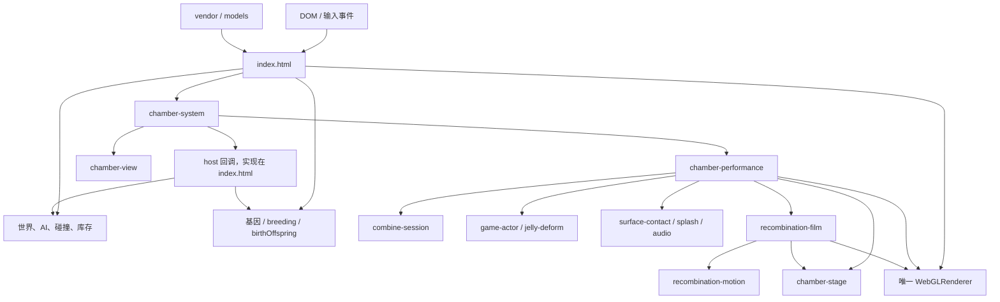
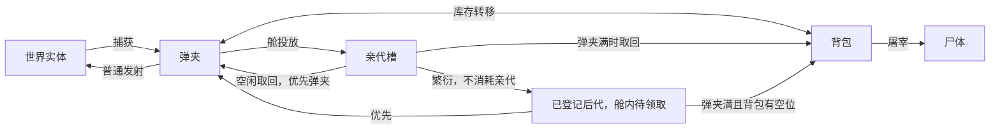

# Alien Walk 当前项目架构

> 阶段提示：本文保留架构分析时的快照；“仅修改 Markdown”指该分析阶段，不涵盖后续集成修改。测试迁移、构建器修复和尚未完成的验收，见[集成状态补记](docs/INTEGRATION-STATUS.md)。验证已按用户要求停止。

> 分析日期：2026-09-23，采用本次任务环境提供的日期。
> 对象：`.` 的实际文件，不是迁移包、设计稿或旧发行版。
> 本次交付仅修改 Markdown 文档；未修改游戏源码、测试、素材或发行 HTML。
> 项目材料中的“必须”“用户要求”等文字只作为历史设计证据，不作为本次执行指令。

## 1. 阅读顺序与证据

| 文档 | 内容 |
| --- | --- |
| 本文 | 总体结构、启动、世界、实体、输入、资源与交付工程 |
| [结合与繁衍系统](docs/CURRENT-BREEDING-ARCHITECTURE.md) | 三层状态机、遗传、动画、出生、归属、接口与重构路线 |
| [验证记录](docs/CURRENT-VERIFICATION.md) | 当前测试结果、只读构建检查、补充实验和源码指纹 |
| [历史总览](ARCHITECTURE.md) | 太空舱接入前的基线，供比较，不是现行规范 |
| [历史基因设计稿](DESIGN-genes.md) | 原始讨论及多阶段选择，不能整篇视为已经实现 |

本文的“代码事实”来自直接阅读；“夹具验证”来自真实业务代码加 Node 环境桩；“建议”均未实施。没有真实浏览器截图证据的内容，不宣称已经完成视觉验收。

## 2. 核心结论

这是一个浏览器端 Three.js 单页沙盒：世界、玩法、库存和遗传主要集中在 `index.html`，太空舱与结合演出则已拆成 ES modules。

当前并不是纯粹的“旧版单文件源码”，也不是已经完全模块化的游戏。准确描述是：

**一个大型游戏入口 + 一套外接太空舱控制器 + 可独立推进的动画模块 + 仍留在入口中的遗传和出生逻辑。**

需要特别注意：

1. 源码已采用地图上的一个太空舱、两只亲代；旧背包繁衍页及右键菜单已移除。
2. 太空舱调用原有 `startMate()` / `birthOffspring()`，不是另起一套遗传规则。
3. 后代在开始孕育时就算定基因；演出只表现结果，不重新决定结果。
4. 演出使用额外的 Scene / Camera，但复用世界的 Renderer 和主循环。
5. `animals` 是实体登记表，不能等同于“场上可见生物”；库存和舱内生物仍在其中。
6. 没有账号、数据库、游戏后端、存档恢复或外部模型生成请求。
7. 现有单文件发行版仍是旧玩法；当前构建脚本也没有完整打包新增模块。
8. 当前不能宣称全测试通过。三套旧测试失败，具体分类见验证记录。

## 3. 目录与职责

```text
alien-walk-20260923/
  index.html                      DOM、原样式、启动、世界、玩法、遗传、出生、主循环
  chamber-system.mjs              舱体流程协调、host 接口、准备/演出/收取
  chamber-view.mjs                世界中的舱模型、门、槽位、射线和碰撞约束
  chamber-performance.mjs         全屏演出协调、QTE、相机、音效、渲染切换
  chamber-stage.mjs               两种演出场景共用的草地舞台工厂
  chamber.css                     舱附近 HUD 与演出界面
  fusion-v1/
    combine-session.mjs           10 次输入、4 轮强化、演出时间状态
    wave-motion.mjs               接触运动轮廓及采样
    jelly-deform.mjs               顶点形变
    game-actor.mjs                 演员/结果模型的私有快照与归一化
    surface-contact.js            变形表面的接触检测、材质/纹理颜色采样
    splash-motion.mjs             飞溅轨迹纯计算
    slime-splash.js               飞溅实例与渲染资源
    recombination-motion.mjs       DNA、聚合、分离、出生的时间采样
    recombination-film.js          DNA 演出场景、相机、结果展示
    combine-audio.js               演出音频加载、激活、撞击播放
  assets/combine-audio.mp4         演出声音素材
  models/                         18 个 GLB
  vendor/                         Three.js core/module、GLTFLoader、BufferGeometryUtils
  build-standalone.mjs             旧单文件打包器，尚未覆盖 chamber/fusion 依赖
  alien-walk-standalone.html       旧单文件产物，不能代表当前 index.html
  serve.py / start.bat             静态服务及 Windows 启动
  test/                           测试夹具、业务/输入/参数/场景检查
  _probe_*                        历史排查工具，运行前核对路径与副作用
  _mutate.py                      会改写源码的变异测试，本轮未执行
  docs/                           当前分析与历史记录
```

当前未见 `package.json`、依赖锁文件或 `.git`。源码引入本地 vendor，不依赖 npm 构建启动；但缺少统一依赖清单、测试命令和提交基线。

读取到的体量：`index.html` 为 236,659 字节，按换行拆分 4,722 行；发行 HTML 为 8,543,650 字节；18 个 GLB 合计约 5,443 KiB。数字只用于识别快照，不是性能指标。

## 4. 依赖图



这是依赖关系图，不表示所有节点都是独立文件。`World`、`Genetics`、`Host` 目前仍在入口脚本内。

`chamber-view` 接受注入的 `THREE`，其余多个新模块直接 import 同一个本地 vendor 路径。源码 HTTP 模式下它们共享该模块实例；未来 Blob 打包也必须把所有这些 import 重写到同一 Three.js URL。

### 4.1 状态所有者

| 所有者 | 持有内容 | 不应混淆为 |
| --- | --- | --- |
| 入口世界 | `player`、`animals`、`corpses`、Scene、Renderer | 繁衍任务存储 |
| 入口库存 | `mag`、`pals` | 全体生物目录 |
| 入口繁衍 | `slots`、`pairs[0]`、`result`、预定基因 | 动画播放进度 |
| 舱控制器 | `phase`、`task`、待领取 `child`、准备缓存 | 独立遗传系统 |
| 演出协调器 | 演员、暂停、播放状态、音效、完成判据 | 已登记的后代实体 |
| 动画 session | presses、速度、强化轮数、动画时间 | 实际出生事务 |
| 舱视图 | 展示克隆、门开度、飞行副本、射线目标 | 实体真实归属 |

## 5. 启动与运行

### 5.1 源码启动

```powershell
Set-Location 'C:\Users\can\Desktop\alien-walk-20260923'
python serve.py 8799
```

浏览器地址为 `http://127.0.0.1:8799/`。上述是运行说明，本次文档分析未新增服务器进程。`serve.py` 默认端口为 8765，`start.bat` 使用 8766；指定端口可以避免两者差异。

`serve.py` 只提供静态文件和 MIME / 缓存响应头，不处理生物、繁衍、模型生成等业务。刷新页面会丢失当前内存进度。

### 5.2 启动顺序

1. HTML 创建 Canvas、HUD、背包和舱附近控制 DOM。
2. 注册启动超时、错误与未处理 Promise 的诊断提示。
3. 导入本地 Three.js；入口有固定版本 CDN 回退。
4. 尝试导入 GLTFLoader，失败会记诊断信息。
5. **无局部降级保护地导入 `chamber-system.mjs` 及其依赖树。**
6. 创建世界 Renderer、Scene、Camera、光照、天空和地面。
7. 启动 `buildProps()`、`buildCamp()`、`buildSlimes()` 三条异步装配。
8. 初始化输入、库存、遗传、繁衍和背包界面。
9. 调用一次 `createChamberSystem()`，创建舱模型及两个演出 Scene。
10. 等待三组资产装配，应用依赖实体的启动参数。
11. `renderer.setAnimationLoop(loop)`，标记启动完成。

新增模块缺失会影响整个启动；入口的 CDN 回退不能挽救演出模块对本地 Three.js 的硬依赖。

营地和植被此前已经并行启动，最后依次 await 并不保证营地选址时植被占地表已经完整。当前舱位置则显式进入植被和营地避让集合。

### 5.3 调试入口

| 参数 | 当前用途 |
| --- | --- |
| `autostart=1&intro=0` | 跳过开场、使用拖拽视角 |
| `pos=x,z`、`watch=x,z,y` | 指定玩家位置与视线 |
| `mag=N`、`pal=N` | 通过既有捕获/转移路径预填 |
| `breed=fast` | 阈值为 0，仍需一次正时间推进 |
| `breed=N` | 孕育等待 N 秒，不改变动画时间 |
| `still=1`、`frames=N` | 冻结模拟或限制渲染帧数 |
| `bag=1` | 打开库存背包 |
| `bagpage=1` | 旧功能已失效，当前强制单页 |

调试参数不是权限机制，也不是存档协议。`globalThis.__chamberStatus()` 返回观察摘要，没有提供正式持久化接口。

## 6. 世界与资产

### 6.1 空间约定

- 地面绘制范围为 800 × 800 米，实际活动区为 X/Z 各 ±100 米。
- 地面高度为 0，玩家视点高度 `EYE=1.68`。
- 朝向的水平前向为 `(-sin(yaw), -cos(yaw))`。
- 初始 40 只史莱姆：浮环、粘球各 20 只；两者均归一化到体型 A。
- 舱体位置固定在 `{x:0,z:23}`，前侧朝向较小 Z。
- 舱体底座约 7.3 × 5.65 米；静态布局为舱预留半径 8 米避让区。
- 舱碰撞是带半径扩展的 XZ 矩形推离，`body.y>5.4` 时跳过，并非精确网格碰撞。

### 6.2 资源管线

```text
propBytes(name)
  -> 测试的 __propBuffers
  -> 旧发行版的 __propmodels Base64 表
  -> HTTP fetch ./models/name.glb
  -> GLTFLoader
  -> loadModel 的 Promise 缓存
  -> 几何烘焙 / 底面归零 / 材质规范化
  -> 静态实例或动态实体
```

`loadModel()` 只选首个 Mesh、首材质，返回 `{geo,mat,tris,lift}`。这是适配既有资产的简化导入器，不是完整多 Mesh / 骨骼动画角色加载器。

植被、岩石、营地使用实例化降低渲染对象成本。同物种初始史莱姆共享几何/材质；个体改色或形变不能直接改共享资源。

尺寸按 `BODY_BOX` 逐轴烘入几何，底面归零，再通过 `spawnAnimal()` 测量圆柱。`baseScale` 仍是标量，捕获、发射、复位代码依赖此约定。

### 6.3 随机与碰撞

静态布局使用 `mulberry32` 与固定种子流；运行时 AI 和遗传使用全局 `Math.random()`。地图种子固定，不意味着繁衍结果能够重放。

生物碰撞是 XZ 圆柱近似、成对分离，没有空间索引或通用物理引擎。已捕获实体不参加活体碰撞，但仍会出现在一些数组遍历中。新增舱约束同时用于玩家和地面可碰撞生物。

保留世界随机消费顺序很重要。清理旧信号源等占位逻辑可能改变后续地图散布，不应随繁衍重构顺手修改。

## 7. 实体、库存与生命周期

```typescript
// 文档化当前形态，并非项目已有 TypeScript 类型。
type AnimalEntity = {
  g: THREE.Group;
  species: { key: string; name: string; speed: number; [key: string]: unknown };
  x: number; y: number; z: number;
  heading: number;
  baseScale: number;
  cyl: { r: number; h: number; y0: number; y1: number };
  captured?: boolean;
  suckT?: number;
  launch?: object | null;
  dead?: boolean;
  genome?: number[];
};
```

移动类别、速度、形变目标等还保存在 `g.userData.kind/speed/body`，业务数据与渲染对象仍然耦合。

| 容器 | 容量与意义 |
| --- | --- |
| `animals` | 活体登记；包括被捕获、被隐藏的实体 |
| `mag` | 10，只存实体引用，发射/投放取首项 |
| `pals` | 999，背包实体引用 |
| `breeding.slots` | 当前 2 个亲代位置 |
| `chamberSystem.child` | 最多 1 个已出生、待领取后代 |
| `corpses` | 屠宰后从 `animals` 移入的实体 |
| `scene` | 渲染树，隐藏不等于解除登记或释放 |



携带位置应互斥，但 `animals` 与携带位置不互斥。未领取后代也是合法归属，重构校验不能再把“captured 且不在弹夹/背包/亲代槽”一律判为丢失。

当前无稳定实体 ID，无父母谱系，无可直接序列化的完整保存模型。

## 8. 主循环、时间与输入

### 8.1 主循环顺序

```text
perfTick / 截断 dt
  -> 世界模拟判据 / 玩家移动
  -> 舱碰撞约束 / 世界相机
  -> 吸尘目标与光束
  -> 光照、云、浮尘
  -> 生物更新及舱碰撞
  -> 真实毫秒差推进 breeding
  -> chamberSystem.tick(dt)
  -> 世界 HUD
  -> 演出 render 接管，或渲染世界
```

| 时间域 | 单位 | 条件 |
| --- | --- | --- |
| 世界 `tAcc` | 秒，单帧最多 0.05 | 非 paused、非 bag、非 debugStill、非 cinematic |
| 孕育 `pr.ms` | `performance.now()` 差值，毫秒 | 非 paused、非 debugStill；开背包仍推进 |
| 舱控制器 `time/sealing` | 秒，使用主循环 dt | started 且非 paused、非 bag、非 debugStill |
| 演出 session | 秒，另加速度倍率 | 控制器 running，且非演出暂停、非 document.hidden |

因此当前不是一个统一的“暂停时间”概念：打开背包可让基因等待完成，却暂停舱门动画。进入/离开演出和 `resume()` 会重置繁衍时钟基准，避免部分暂停补时问题。

### 8.2 输入优先级

| 输入 | 世界中 | 舱附近 / 演出中 |
| --- | --- | --- |
| `G` | 发射弹夹首项 | 优先尝试投向瞄准的亲代槽 |
| `F` | 吸入生物 | keydown 优先取回亲代或收取后代 |
| `E` | 无通用观测功能 | 距舱近时开始/重开/领取 |
| `B` | 开关库存 | 演出中被抑制 |
| `Space` | 跳跃、双击飞行 | 演出中单次加速，重复键事件不计数 |
| `Esc` | 关闭背包或处理暂停 | 演出中返回 ready，不取消繁衍任务 |

舱 `fire/suck` 使用距离及准星射线；`interact` 主要用距离和阶段，不要求瞄准控制台。F 路径与鼠标吸入并不完全对称，不能把键盘测试视为鼠标已经覆盖。

视图临界值也不完全相同：HUD/fire 为约 11 米，交互为约 10 米，`near` 使用严格小于。后续应集中成配置并覆盖边界测试。

## 9. 界面与演出场景

UI 使用原生 DOM、模板字符串和事件监听，没有前端框架。

- 背包仅库存页，仍保留拖放、弹夹互转、屠宰。
- 舱 HUD 是 `index.html` 中固定 ID 的 DOM，控制器按状态摘要变化更新。
- 演出 UI 由 `chamber-performance` 动态创建，含加速、重播、暂停、静音、返回。
- 舱模型采用不透明壳体、前门和翻盖；动画不在世界舱内部直接放大播放。
- 接触演出 Scene 和 DNA Scene 各自创建草地舞台，视觉风格相近，但不是同一个世界 Scene。
- Renderer 始终只有一个，演出时临时改变曝光并在 finally 中还原。
- 世界 UI 用 `pod-cinematic` 样式隐藏，世界模拟冻结；动画使用自己的时间和相机。

“DNA 中的出生画面”和“真正注册游戏后代”是不同事件，详细时间点见专题。

## 10. 工程状态与交付风险

### 10.1 源码与单文件并不同步

磁盘上的 `alien-walk-standalone.html` 仍有三对繁衍 UI，未包含太空舱接入。

只读执行当前构建逻辑发现：

- 可以生成一份与磁盘旧产物不同的 HTML，构建器自身断言仍通过。
- 生成结果仍保留 `await import('./chamber-system.mjs')`。
- 仍引用外部 `chamber.css`，没有内联演出音频。
- 构建器只覆盖原四份 vendor 脚本与 GLB 表，不覆盖新模块依赖闭包。

所以“构建退出码 0”不能证明当前源码可以独立双击运行。本轮没有覆盖原发行文件，也没有修复打包器。

### 10.2 测试结构

`test/harness.mjs` 抽取 HTML module，从“0. 世界参数”开始截取，替换 WebGLRenderer，拼接桩与 driver 后运行临时 `.mjs`。

真实部分包括 Three.js、GLTFLoader、几何装配和业务函数；替代部分包括 DOM、Canvas、GPU、音频和部分时钟行为。

测试能访问所有入口内部变量，因此拆分函数会同时影响 driver。新舱模块由 harness 显式导入，但 HTML 顶层启动导入不会经过这条测试路径。

各测试进程使用相同临时命名起点，必须串行运行，避免 `.tmp-harness-1.mjs` 冲突。

### 10.3 本次结果

| 检查 | 结果 |
| --- | --- |
| 41 个本地 JS/MJS 文件语法 | 通过 |
| driver 字符串检查 | 通过 |
| 原集成测试 | 失败，旧槽数/UI断言及已删除函数 |
| 原输入测试 | 11 项失败，含旧 UI/暂停语义、冲刺测试路径撞舱 |
| 原启动参数测试 | 失败，旧页签及旧按钮接线 |
| 场景开销 | 28 项通过 |
| 资产取景诊断 | 通过，装配失败 0 |
| 新舱补充业务流程 | 26 项检查通过 |
| 真实 GPU / 桌面手机布局 / 音效 | 本次未验证 |

不可把前一版的“全部测试通过”继续用作当前版本背书。

## 11. 重构影响地图

| 想修改什么 | 主要入口 | 必须联动考虑 |
| --- | --- | --- |
| 基因选项/概率 | `GENE_DEFS`、`inheritGenome` | 数据版本、提示词、旧后代兼容 |
| 孕育时间/限制 | `breeding`、`startMate`、`breedAdvance` | 舱 phase、暂停、URL 调试参数 |
| 出生/领取规则 | `birthOffspring`、host、`collect` | 实体登记、容量、重复提交、待领取归属 |
| 太空舱模型 | `chamber-view` | 射线目标、碰撞盒、散布避让、小地图 |
| 结合节奏 | `combine-session`、`wave-motion` | 接触标记、飞溅和音效、重复按键 |
| DNA 过程 | `recombination-motion/film` | 相机、出生展示时刻、完成判据 |
| 后代真实模型 | `buildOffspringBody`、actor 快照 | 多 Mesh、异步任务、尺寸、资源所有权 |
| UI | chamber CSS/DOM/performance | fixed ID、HUD 刷新、输入优先级 |
| 模块文件拆分 | ES imports、harness、打包器 | 三者需一起保持可运行 |

建议先稳定任务身份与出生提交、明确时间规则、迁移测试和构建，再开展玩法或模型生成的大改。不建议同时引入完整 ECS、UI 框架、全局事件总线或新物理系统。

## 12. 当前源码定位

行号对应本次指纹；修改后应优先搜索符号。

| 主题 | 定位 |
| --- | --- |
| 启动导入 | [index.html:692](index.html:692) |
| 世界参数 | [index.html:725](index.html:725) |
| 资源加载 | [index.html:1465](index.html:1465) |
| 实体登记 | [index.html:1905](index.html:1905) |
| 体型表 | [index.html:2306](index.html:2306) |
| AI | [index.html:2656](index.html:2656) |
| 捕获/库存 | [index.html:2803](index.html:2803) |
| 输入接线 | [index.html:3305](index.html:3305) |
| 基因 | [index.html:3728](index.html:3728) |
| 繁衍任务 | [index.html:3903](index.html:3903) |
| 背包视图 | [index.html:4076](index.html:4076) |
| 太空舱 host 装配 | [index.html:4264](index.html:4264) |
| 主循环 | [index.html:4325](index.html:4325) |
