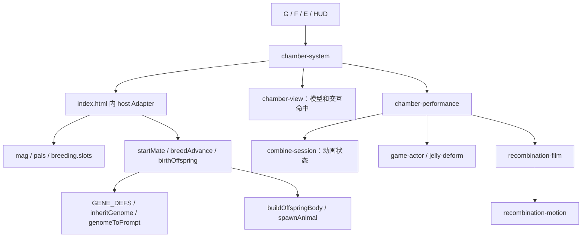
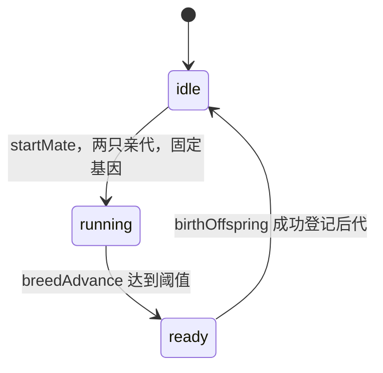
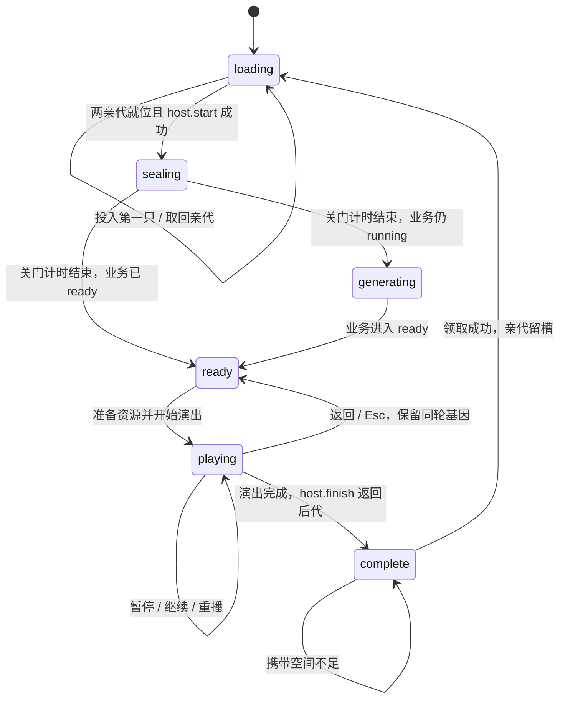
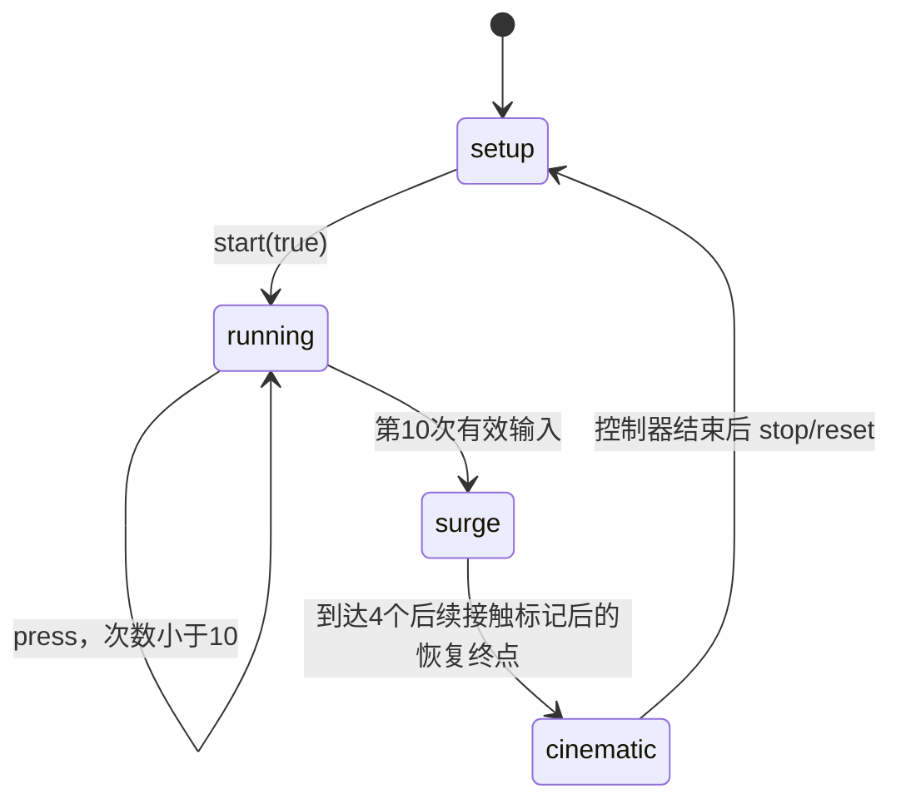
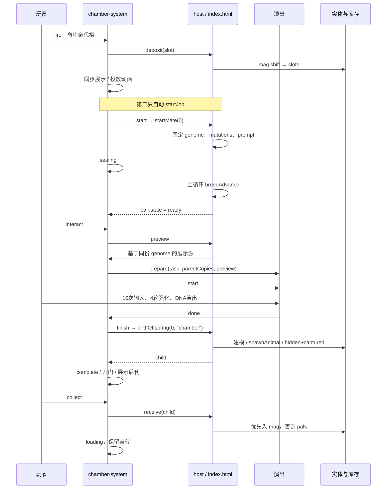

# 结合（繁衍）系统架构与重构准备

> 阶段提示：本文是架构分析阶段快照，不是最新集成验收报告。后续镜头、场景、测试与构建改动见[集成状态补记](docs/INTEGRATION-STATUS.md)。验证已按用户要求停止，完整动画链路仍未验收。

> 当前源码分析，日期 2026-09-23。配套：[项目总览](docs/CURRENT-ARCHITECTURE.md) · [验证记录](docs/CURRENT-VERIFICATION.md)。
> 本文描述已经存在的实现，并单独列出重构建议；不把历史注释、设计稿或建议当作新需求。

## 1. 先统一术语

| 术语 | 本文定义 | 当前对应 |
| --- | --- | --- |
| 亲代 | 本轮两个输入实体，不会因结合消失 | `breeding.slots[0/1]` |
| 孕育 | 从确定基因到等待结束 | `startMate` → `breedAdvance` |
| 结合演出 | 两亲代接触、加速、强化、DNA 与出生画面 | `chamber-performance` / `fusion-v1` |
| 出生提交 | 创建真实后代、加入实体登记、结束本轮基因任务 | `birthOffspring` |
| 领取 | 把已经出生的后代从舱移入携带容器 | `chamberSystem.collect` |
| 世界舱 | 地图中唯一的可交互设施 | `chamber-view` 的 `breeding-pod` |
| 展示副本 | 克隆网格，用于舱内、飞行或演出 | 不是可捕获的游戏实体 |
| 任务身份 | 一轮繁衍的身份，而非设施/槽位编号 | 当前只有控制器局部计数 `task` |

**出生画面、出生提交、领取必须分开理解。** 同样，`ready` 在不同层表示不同事实，不能只凭字符串相同就合并状态。

## 2. 当前玩法事实

| 事项 | 当前实现 |
| --- | --- |
| 设施/并行数量 | 一舱、一对、两格；`BREED_PAIRS=1` |
| 投入来源 | 弹夹首项；瞄准左/右槽后 G 或 HUD 投放 |
| 开始时机 | 第二只投放后自动开始；领取后可 E 再次开始 |
| 亲代限制 | 未做性别、亲缘、同物种限制 |
| 子代决定时机 | `startMate()` 当场算定 32 位基因及提示词 |
| 默认孕育 | 90 秒真实毫秒累计；URL 参数可以改阈值 |
| 舱门 | 先留约 0.5 秒供投放，再关门；sealing 约 1.4 秒 |
| 门与倒计时关系 | 倒计时从 `startMate` 起，包含关门过程，不是关完再加 90 秒 |
| 等待结束 | 舱进入 ready，需交互开始演出 |
| 加速输入 | 10 次非 repeat 输入，从 1× 到 3× |
| 强化 | 4 个后续接触时间标记，速度平滑升至最高 6× |
| 不按满 10 次 | 接触过程继续循环，不会自行进入 DNA 结尾 |
| 返回/重播 | 不重抽基因；返回回到 ready，重播重置演出时间 |
| 动画完成 | 创建一个后代，亲代仍留槽，舱重新打开 |
| 领取优先级 | 弹夹有空位先入弹夹，否则入背包 |
| 两容器全满 | 后代继续留舱，不清空领取资格 |
| 取回亲代 | loading 时；优先弹夹，其次背包 |
| 未领取时再繁衍 | 舱控制器不允许；complete 交互只尝试领取 |
| 刷新/退出页面 | 无恢复，不保留任务或后代 |
| 远程模型生成 | 未实现；提示词未发送到外部服务 |

旧 `palToSlot`、`slotToBag`、`takeBaby`、`onBirthAnim` 仍在入口中，但已经不是玩家的主要入口。保留函数不等于旧背包 UI 仍存在。

## 3. 分层职责



### 3.1 已有分离

- 基因计算不由动画文件复制实现。
- session 和运动采样主要是纯计算，可不依赖 DOM 测试。
- 世界亲代与演出演员使用独立几何，正常演出不污染原模型。
- 实际后代仍由原有实体装配函数创建，兼容现有捕获/发射/库存逻辑。
- 世界渲染和演出渲染共用 Renderer，避免第二个 Canvas/WebGL 上下文。

### 3.2 尚未分离

- 遗传定义、库存和业务任务仍处于同一个 HTML module 作用域。
- `chamber-system` 同时负责领域流程、展示资源、HUD 文案和 DOM 事件。
- host 把可变 `slots` 和 `pairs[0]` 直接返回，没有只读快照约束。
- 没有共同的完整任务对象；状态被拆散在入口、控制器和动画 session。
- 出生和领取仍是多步副作用，没有原子提交或失败补偿。

## 4. 数据结构与归属

### 4.1 基因

```typescript
// 以下均为对源码的文档化，不是已存在的类型声明。
type Genome = number[]; // 32 个整数，每个值是该位 opts 的下标
type GeneDefinition = {
  n: number;            // 文档序号 1..32
  key: string;
  say: string;
  opts: string[];
};
```

例如 `GENE_DEFS[0]` 是第 1 位骨骼，`genome[0]=0` 表示骨骼选项下标 0。编号、数组位置、选项值是三件事。

当前没有 schemaVersion、输入长度校验、值域校验或不可变封装。

### 4.2 入口的繁衍状态

```typescript
type PairState = {
  state: "idle" | "running" | "ready";
  ms: number;
  genome: number[] | null;
  mutations: GeneDefinition[];
  prompt: string;
};
type BreedingState = {
  slots: [AnimalEntity | null, AnimalEntity | null];
  pairs: [PairState];
  result: null | {
    mutations: GeneDefinition[];
    name: string;
    prompt: string;
  };
};
```

这里没有父母快照、子代 ID、job ID、资源状态、错误状态。`mutations` 保存整份定义对象引用，不记录原值/新值。`result` 只保留最近一次结果，后代实体没有完整谱系。

### 4.3 控制器附加状态

| 字段 | 含义 |
| --- | --- |
| `phase` | loading / sealing / generating / ready / playing / complete |
| `task` | 每次成功 `startJob()` 加一；控制器局部数字 |
| `sealing` | 关门阶段秒数 |
| `child` | 已出生、未领取的真实实体 |
| `prepared` | 根据预定基因构造的展示源 Group，不在 `animals` |
| `preparedId` | 展示资源对应的 task |
| `lastParents` | 用实体引用判断是否重建舱内展示 |
| `time` | 舱动画时间 |
| `lastHud` / `notice` | 更新节流摘要及提示 |

`task` 目前用于准备缓存及同步完成检查，没有传入 `birthOffspring()`。它不是全局可验证或可持久化的任务主键。

### 4.4 一只亲代对应多少对象

```text
真实实体 a
  ├─ a.g：世界模型，被捕获后隐藏
  ├─ 舱槽展示克隆：仅渲染
  ├─ 投放/取回飞行克隆：临时渲染
  └─ 演出演员快照：可形变的独立几何
```

后代也有“预览源、影片结果快照、真实出生实体、舱内展示克隆”这些不同对象。不要因画面上看到结果就认为它已经进入 `animals` 或库存。

本次夹具验证覆盖了实际后代基因与预定基因相同、两只原亲代顶点未变化。

## 5. 三层状态机

### 5.1 业务任务



这个状态机不知道关门、播放、重播和领取。动画播放时它仍是 ready；真实后代在舱内等待领取时它已经是 idle。

### 5.2 舱控制器



“返回”不是取消孕育，也不解锁亲代。当前没有在 generating/ready 阶段放弃任务的正式命令。

### 5.3 演出 session



session 本身没有 complete；`chamber-performance` 通过 `cinematicTime >= 5.3+1.5` 设置 `done`，再由控制器提交出生。

### 5.4 状态对应关系

| 舱 phase | 业务 pair.state | 动画 session |
| --- | --- | --- |
| loading | idle | setup |
| sealing | running 或 ready | setup |
| generating | running，切换帧可能已 ready | setup |
| ready | ready | setup |
| playing | ready | running / surge / cinematic |
| complete | idle | setup，演出已停止 |

这些组合是正常主流程的约定，不是统一对象强制维护的不变量。直接调用旧辅助函数可能绕开舱控制器，使两层状态分离。

## 6. 完整调用时序



## 7. 遗传规则详解

### 7.1 全部 32 位

颜色位共用 13 色，有无位共用 `0=有，1=无`。

| 编号/下标 | key | 选项 |
| --- | --- | --- |
| 1 / 0 | skeleton | 无骨骼质点 |
| 2 / 1 | body | A、B、C、D、E、F |
| 3 / 2 | bodyColor | 13 色 |
| 4 / 3 | bodyTex | 光滑、黏滑、粗糙、胶质、结晶、金属、毛绒、甲壳 |
| 5 / 4 | bodyForm | 球形、奶龙、标准哺乳动物、史莱姆形 |
| 6 / 5 | eyeOn | 有、无 |
| 7 / 6 | eyeColor | 13 色 |
| 8 / 7 | eyeForm | 动物眼、机器眼、蜗牛眼、emoji眼 |
| 9 / 8 | earOn | 有、无 |
| 10 / 9 | earColor | 13 色 |
| 11 / 10 | earForm | 动物耳、机器耳、emoji耳、精灵耳 |
| 12 / 11 | hornOn | 有、无 |
| 13 / 12 | hornColor | 13 色 |
| 14 / 13 | hornForm | 羊角、牛角、独角兽、王冠、头盔、机器天线 |
| 15 / 14 | wingOn | 有、无 |
| 16 / 15 | wingColor | 13 色 |
| 17 / 16 | wingForm | 羽翼、翼龙的翼、螺旋桨 |
| 18 / 17 | tailOn | 有、无 |
| 19 / 18 | tailColor | 13 色 |
| 20 / 19 | tailForm | 兽尾、恐龙尾、鱼尾、机器尾巴 |
| 21 / 20 | backOn | 有、无 |
| 22 / 21 | backColor | 13 色 |
| 23 / 22 | backForm | 龙鳍、剑骨、背着机枪、背着背包 |
| 24 / 23 | limbOn | 有、无 |
| 25 / 24 | limbColor | 13 色 |
| 26 / 25 | limbForm | 标准小动物、标准大动物 |
| 27 / 26 | clawOn | 有、无 |
| 28 / 27 | clawColor | 13 色 |
| 29 / 28 | clawForm | 尖锐、巨大 |
| 30 / 29 | glowOn | 有、无 |
| 31 / 30 | glowColor | 13 色 |
| 32 / 31 | glowForm | 安康鱼、机器指示灯 |

颜色存储顺序：红、黄、蓝、绿、紫、浅红、浅黄、浅蓝、浅绿、浅紫、灰、黑、白。

选项下标就是当前数据身份，改顺序会改变已有数组的意义。中文显示名也直接参与提示词，不是独立的本地化层。

### 7.2 亲代默认值

`genomeOfPal(a)` 优先返回 `a.genome`，否则按 `species.key` 获取 `_initialGenomeCache` 中的默认数组。

默认基因：

- 体型取物种 body，缺省 A。
- 粘球史莱姆主体浅蓝；其他 key 默认白。
- 主体形态球形、主体质感胶质。
- 九个有无位均为无；其余颜色/形态位取第一档。

默认数组由同物种共享，函数不复制、不冻结。当前只读使用没有问题；未来基因编辑若原地写入，会污染同物种默认值。

### 7.3 继承与突变顺序

```text
对每个 i：
  50% 取父母之一的该位
  独立抽取是否发生 5% 突变
  只有1个选项则不变
  否则在本位所有选项中重抽，直到不等于继承值
  记录该位的 GeneDefinition
```

准确含义：

- 不是整段染色体交叉，也不保证一半位点来自每一亲代。
- 突变只排除本次继承值，可以恰好等于另一亲代的值。
- 骨骼位不可变化，所以有效可变位为 31；独立均匀假设下每胎期望有效变化数为 `31×0.05=1.55`。
- 有无为无时，其颜色/形态仍参与遗传，后代再繁衍时也可能表达。
- 使用全局随机；没有记录 seed，也没有独立繁衍随机流。
- 拒绝抽样没有上限，测试若注入总返回原选项的随机值，会无法退出。

### 7.4 提示词与表现不是同一层

`genomeToPrompt()` 写入主体形态、体型字母、颜色、材质，以及存在的附加部件；不存在的部件不写。它是纯文本结果，不是网络任务。

`buildOffspringBody()` 只创建程序化球体，表达体型、主体色、材质和整体发光。不创建眼、耳、翅膀等零件，也不给予飞行能力。所有后代仍设置 `kind:"land"`。

`mutationLines()` 仍定义，`breeding.result` 仍记录突变，但当前舱 UI 没有消费它显示位点列表。不能沿用旧文档“接生后展示突变详情”的说法。

## 8. 后代模型与速度

### 8.1 体型目标盒

单位米，XYZ 为宽、高、深。

| 档位 | X | Y | Z |
| --- | ---: | ---: | ---: |
| A | 1.488 | 1.832 | 1.869 |
| B | 2.083 | 2.565 | 2.617 |
| C | 2.678 | 3.298 | 3.364 |
| D | 3.274 | 4.030 | 4.112 |
| E | 2.678 | 1.832 | 3.364 |
| F | 1.488 | 3.298 | 1.869 |

流程：clone 单位球几何 → 逐轴缩放 → XZ 居中/底面归零 → 独立材质 → Group → `spawnAnimal` 测圆柱。

演出快照还会缩放到展示尺寸，舱内亲代最长边上限约 2.05、后代约 1.65；这不改变真实游戏实体的基因体型。

### 8.2 速度

出生时取两个亲代 `species.speed` 的均值，缺值采用 0.6。当前代码同时写：

```text
offspring.species.speed
offspring.g.userData.speed
```

ring 0.52 与 ball 0.72 的后代两处均为 0.62。本轮已复现；旧版速度不一致的缺陷不应继续列为当前未修问题。

## 9. 动画管线

### 9.1 世界舱动画

`chamber-view` 自有几何/材质/CanvasTexture，负责：

- 两亲代展示槽、子代展示点、控制台命中区。
- 前门收缩抬升与顶盖绕铰链旋转。
- `.48` 秒平滑弧线投放/吸回飞行，过程中缩放。
- loading / complete 打开，其他阶段关闭。
- 状态牌和灯光脉动。
- XZ 矩形碰撞推离。

射线对隐藏材质的交互体求交，不直接对所有外壳网格求交。舱中只保留一个 `flight`，下一次投放会释放前一飞行副本；这不是支持多条并行投放轨迹的队列。

### 9.2 接触与形变

```text
session.time
  -> sampleCombination / sampleWave
  -> waveSections（轮廓切片）
  -> 每个 actor.applySections
  -> 顶点变形 / 法线与包围信息重算
  -> 接触时间标记
  -> findContactPair（已变形表面）
  -> gap < 0.25 且 confirmContact 成功
  -> 纹理/顶点/材质采色
  -> 飞溅 + 撞击音效
```

`wave-motion` 的引入时长为 0.8 秒、周期 2.8 秒。普通结合会循环采样，而不是播放固定五轮后自行结束。

表面采样优先结合命中 UV、贴图、顶点色与材质色；读像素失败则回退材质色。纹理读取缓存使用 WeakMap。只有真实浏览器才能验证实际贴图色与飞溅观感。

**重要语义：强化计数来自跨过时间标记，不来自 `confirmContact()` 成功次数。** 实际表面接触确认控制飞溅/声音，但没有阻止 session 在四个标记后进入 DNA。若新规则要求“四次真实接触必须全部发生”，需要改变契约并补测试。

### 9.3 DNA 时间轴

以下为进入 cinematic 后的局部秒数，不包含 90 秒等待、普通接触或强化阶段。

| 时间 | phase | 展示含义 |
| --- | --- | --- |
| 0–0.08 | entry | 承接上一镜头 |
| 0.08–1.00 | drawing | 亲代拉为彩色曲线 |
| 1.00–2.50 | weaving | 双螺旋缠绕 |
| 2.50–3.35 | coiling | 聚合 |
| 3.35–3.65 | sphere | 聚合球短暂停留 |
| 3.65–4.30 | separating | 分离和散开 |
| 4.30–5.30 | birth | 展示子代，缩放和抬升 |
| 5.30 以后 | result | 结果稳定展示 |
| 6.80 | performance.done | 控制器可提交实际出生 |

影片自己的 `onBirth` 在 4.30 秒触发，但当前宿主没有用它创建实体。真实 `birthOffspring` 在演出完成检查后才执行。

DNA 是视觉表现，不是再次计算遗传的算法。影片结果来自 `createFilmResult(preview)`，实际出生再次用同一基因构造新模型。

### 9.4 Renderer 与资源生命周期

| 资源 | 创建者 | 清理/替换 |
| --- | --- | --- |
| 世界原亲代 geometry/material | 原世界资源管线 | 不由演出释放 |
| 槽内克隆 | system `cloneVisual` | view 换亲代/dispose |
| 飞行克隆 | system | view 飞行完成、替换或 dispose |
| 预览源 | host.preview | system clearPrepared |
| 演出演员快照 | game-actor | 下次 prepare 或 performance.dispose |
| 影片亲代快照 | recombination-film | reset / dispose |
| 影片结果快照 | createFilmResult | setResultAsset 替换或 dispose |
| 舞台/飞溅/环境贴图 | stage/splash/performance | 各自 dispose |
| 音频 context/source | combine-audio | stop / dispose |
| 世界实际后代 | birthOffspring | 不随演出 stop 释放 |

材质 clone 并不深拷贝贴图；展示副本释放 geometry/material，但不释放共享贴图，这与当前共享资源策略一致。

`stop/reset` 不等于释放全部资源：演员和结果资源可保留至下一次准备。这是有保留生命周期的缓存，不能仅因 stop 后仍占内存就断言永久泄漏。

异常路径仍缺完整补偿；当前 `dispose` 也没有解除舱 HUD 的三个点击监听，适合单次初始化，不应直接假定能反复卸载重建。

## 10. 对外接口及隐含约束

### 10.1 host Interface

定义位置：[index.html:4264](index.html:4264)。

| host 成员 | 返回/行为 | 隐含要求 |
| --- | --- | --- |
| `parents()` | 可变 slots 数组 | 恰好两格；实体有可渲染 g |
| `job()` | 业务任务引用 | 存在 state |
| `remaining()` | 毫秒 | 非负，不是秒 |
| `loadedName()` | 弹夹首项名称 | 与 deposit 实际取出一致 |
| `active()` | 允许交互 | started、未暂停/开包/演出 |
| `running()` | 允许舱时间推进 | 演出中仍可 true |
| `visible()` | 显示舱 HUD | 不等于允许输入 |
| `deposit(slot)` | 实体或 null | 从弹夹原子搬至空槽 |
| `withdraw(slot)` | boolean | 成功才清槽，容量不足保持 |
| `receive(entity)` | boolean | 优先弹夹再背包，避免两容器重复 |
| `start()` | boolean | 开始业务任务并固定结果 |
| `preview()` | Group 或 null | 仅展示，不登记实体 |
| `finish()` | 实体或 null | 实际出生且不直接入包 |
| `setCinematic(flag)` | 切输入/样式/指针锁 | 清按键，重置计时基准 |
| `sound` / `notice` | 反馈 | 非规则计算 |
| `isMuted` / `toggleSound` | 声音设置 | 世界和演出共享静音意图 |

控制器现在必须知道这些回调的执行顺序、资源所有权和失败后状态，Interface 的实际复杂度大于参数列表。

### 10.2 系统入口

| 成员 | 行为 |
| --- | --- |
| `fire()` / `suck()` | 返回是否消费了世界输入；true 不一定表示成功转移 |
| `interact()` | 开始下一轮、开始演出或领取 |
| `cancel()` | 仅 playing → ready |
| `collect()` | 仅 complete 且有 child，成功后 loading |
| `tick(dt)` | 同步亲代、推进阶段、完成出生、更新视图/HUD |
| `boost(repeat)` | 只在 playing 转给演出 |
| `render(renderer)` | 返回是否接管本帧渲染 |
| `constrain(body,radius)` | 原地修改实体/玩家坐标 |
| `cinematic / near / aimed / child` | 查询状态 |
| `status()` | 调试摘要，不是存档 |
| `dispose()` | 清理大部分展示资源 |

`fire/suck` 中“槽已满”“忙碌”“弹夹空”也可能返回 true，目的是阻止该输入继续落到普通世界行为；不能把其返回值当作统一的业务成功码。

### 10.3 旧业务函数

| 函数 | 当前契约 |
| --- | --- |
| `pairReady(p)` | 只表示两亲代齐全，不是任务 ready |
| `pairCanMate(p)` | idle 且两亲代齐全 |
| `startMate(p)` | 算定基因并置 running |
| `breedAdvance(ms)` | 累计正毫秒，达到全局阈值转 ready |
| `birthOffspring(p,destination)` | ready 且有 genome；默认 bag 先检查容量 |
| `takeBaby(p)` | 旧动画回调路径，当前主 UI 不用 |

`destination` 是字符串判定，不是受验证的枚举；非 `"bag"` 值会绕过背包插入。因此不能把 `birthOffspring` 原样作为未来不受信任输入的公开入口。

## 11. 出生与领取的事务分析

### 11.1 实际出生顺序

```text
检查 ready + genome
  -> 默认 bag 目的地先查容量
  -> 读取当前槽位亲代速度
  -> buildOffspringBody
  -> spawnAnimal：scene + animals + 圆柱
  -> 复制 genome / captured / hidden
  -> bag 路径入包，chamber 路径暂不入携带容器
  -> 写 breeding.result
  -> 清空 pr 并回 idle
  -> 返回实体
  -> 控制器 child = entity
  -> 克隆舱内展示
  -> phase = complete
```

目前正常同步路径能完成一次出生并阻止重复领取，已通过夹具验证。但它并非带 jobId 的幂等事务：

- `task` 校验前的 `host.finish()` 不接收 task ID。
- `birthOffspring` 在 UI 展示更新前已经清空业务任务。
- 几何克隆或视图装配若在提交后抛错，控制器可能仍是 playing，而业务已 idle。
- 没有错误 phase 和恢复命令来收拾中间状态。

以上异常风险来自静态调用顺序，本轮没有注入内存/建模失败进行复现。

### 11.2 领取顺序

先 `host.receive(child)`，再创建吸回展示、清理子代视图，最后清 `child` 并回 loading。

空间不足在第一步返回 false，后代保持可领取，已验证。若后续展示创建抛异常，则库存可能已经接收但控制器仍持有 child；后续 receive 因重复检测返回 false，缺恢复机制。

业务成功不应依赖装饰动画能否成功创建，这是后续拆分应封装的保证。

### 11.3 旧回调风险的变化

旧 `onBirthAnim(pair, done)` 仍只捕获 pair 下标。当前新增的 ready 检查能阻止旧回调直接接生下一轮 running；但如果旧回调拖到下一轮也 ready，它仍不能识别任务身份。

当前玩家主流程没有接入该旧钩子，所以这是保留扩展点的静态风险，不是已经证明普通 UI 会重复出生。

## 12. 当前问题、变化与优先级

### 12.1 当前需要处理

| 优先级 | 问题 | 证据类型 | 重构影响 |
| --- | --- | --- | --- |
| 高 | 新模块未进单文件依赖闭包，磁盘产物仍旧版 | 只读构建实验 | 双击交付与源码不一致 |
| 高 | 三套旧测试失败，旧文档/注释仍描述三对槽 | 实际测试/静态 | 不能把旧全绿当新基线 |
| 高 | 业务提交不接收 jobId，状态分散三层 | 静态 | 异步/多舱/恢复会放大风险 |
| 高 | 提交和展示异常缺补偿 | 静态 | 可能形成出生后不可正常领取的中间态 |
| 中 | 突变结果有数据但无现行展示消费者 | 静态 | 旧功能反馈已断开，是否恢复需决策 |
| 中 | 三种计时条件不同 | 静态 | 背包/暂停/隐藏时出现阶段差异 |
| 中 | 共享默认基因可变、全局随机不可重放 | 静态 | 基因编辑和确定性回归困难 |
| 中 | 输入/距离判定分散 | 静态 | 键鼠体验、距离边界、重绑定测试 |
| 中 | 单实例 DOM ID、只存一个 flight | 静态 | 不能直接多次创建来实现多舱 |
| 中 | 现有模型导入不支持完整复杂角色 | 静态 | 接外部生成模型需更完整的装配 |
| 低至中 | 遗留函数、CSS、注释尚未清理 | 静态 | 存在绕过新流程的维护入口 |

### 12.2 不应误报为仍未修复

| 旧结论 | 当前状态 |
| --- | --- |
| 背包繁衍页倒计时不刷新 | 旧页已删除；新 HUD 由 tick 按摘要更新 |
| 满包出生导致后代丢失 | 默认 bag 路径先查容量；舱路径保留 child，满容量保留已验证 |
| 后代配置速度与实际速度不同 | 当前两处同步写入，0.62 场景已验证 |
| 拖拽模式 Esc 总是恢复 | 当前改为暂停切换 |
| 没有独立结合动画 | 当前存在完整模块及时间流程，但本轮未做视觉验收 |
| 完全没有任务编号 | 控制器已有 task；仍未贯穿领域提交和持久化 |

## 13. 建议的重构方向

目标不是按函数数目拆更多文件，而是让调用者不再需要手工协调任务身份、随机结果、资源准备和库存提交。

### 13.1 建议 Module

| Module | 拥有 | 不拥有 |
| --- | --- | --- |
| Genetics | schema、校验、默认值、继承、突变、提示词 | DOM、Three.js、库存 |
| Breeding | 任务身份、亲代占用、结果快照、时间、领取资格 | 几何形变、按钮文案 |
| Birth/Inventory Adapter | 实体准备/登记、目的地容量、归属转移 | 再抽一份基因 |
| Presentation | 舱展示、演出时间与结果通知 | 决定后代规则或直接写库存 |

当前程序化模型生成是真实 Adapter；未来远程生成可以在确有需求时实现另一种 Adapter，不必提前搭建队列/后端框架。

### 13.2 建议任务模型

```typescript
// 建议，尚未实现。
type BreedingJob = {
  id: string;
  chamberId: string;
  parentIds: readonly [string, string];
  parentGenomeSnapshots: readonly [GenomeV1, GenomeV1];
  offspringGenome: GenomeV1;
  mutationKeys: readonly string[];
  durationMs: number;
  elapsedMs: number;
  phase: "incubating" | "ready" | "presenting" | "unclaimed" | "claimed";
  offspringId?: string;
};
type GenomeV1 = {
  schemaVersion: 1;
  alleles: readonly number[];
};
```

动画 session 可以继续保留其细粒度阶段，但不应成为领取资格的唯一真相。多个层次允许存在，但必须有明确权威和可验证映射。

### 13.3 建议小 Interface

```text
placeParent(chamberId, slot, entityId)
removeParent(chamberId, slot)
start(chamberId)
advance(elapsedMs)
beginPresentation(jobId)
finishPresentation(jobId)
claim(jobId)
getSnapshot(chamberId)
```

这只是行为草图，最终不一定需要八个公开方法。每个命令必须封装前置校验、归属变更、任务匹配和失败无副作用保证。

返回结构化结果，如 `BUSY`、`NO_CAPACITY`、`STALE_JOB`、`ALREADY_CLAIMED`；“是否消费世界按键”留给输入 Adapter，不混入业务成功码。

### 13.4 建议出生协议

```text
固定 jobId、亲代快照、基因、时长
  -> 准备尚未登记的结果资产
  -> 播放展示
  -> finish(jobId) 校验当前任务、阶段、是否已提交
  -> 一次性登记真实子代，归属 unclaimed
  -> claim(jobId) 尝试转移库存
  -> 展示/音效失败不回滚或重复已完成的业务
```

模型准备、影片中揭示模型、实体创建、库存领取可以分离。是否保留 6.8 秒后才创建实体是玩法选择，不是必须沿用的技术限制。

若将来接异步模型，至少还需要任务取消/过期处理、结果关联、重试、尺寸校验、错误恢复和资源清理；不是把同步 `buildOffspringBody()` 换成 Promise 就结束。

## 14. 建议迁移步骤

| 阶段 | 工作 | 完成标准 |
| --- | --- | --- |
| 0 | 固定当前源码、规则与测试基线 | 已知失败分类；旧发行版明确标识 |
| 1 | 修复测试入口与构建依赖闭包 | 源码/双击路径等价，基础测试可用于回归 |
| 2 | 提取 Genetics，注入随机 | 独立测试 schema、固定序列继承/突变、默认值不污染 |
| 3 | 引入实体/job 身份和不可变结果 | 旧任务不能改新任务，父母快照稳定 |
| 4 | 统一出生与领取提交 | 重复调用无重复实体，容量/展示失败不丢结果 |
| 5 | 明确时间与输入 Interface | 背包、暂停、隐藏、重播行为均有测试 |
| 6 | 收拢 presentation 和删除旧入口 | 不再依赖旧回调/页签/直接槽位写入 |
| 7 | 按需接远程资产/存档/多舱 | 独立需求评审，再加入新 Adapter |

可保留现有动画算法和世界素材，不必为状态重构重做形变、DNA 或地图。

## 15. 验收不变量与测试矩阵

### 15.1 不变量

1. 每只真实实体最多属于一个携带位置或舱内未领取位置。
2. `animals` 登记与携带归属可以重叠，但同一实体不能同时在两个携带位置。
3. 一轮最多创建一个真实后代；重复完成/领取不得再次创建。
4. 基因在开始时固定，返回、重播、等待、渲染都不重新抽样。
5. 旧任务回调不能影响同舱下一轮。
6. 任何容量或展示失败不得悄悄消耗未领取结果。
7. 演出只修改私有网格，不改变原亲代及共享资产。
8. 业务速度与运行时速度一致，后代可再次作为亲代。
9. 计时仅累加产品明确允许的区间。
10. 移除/重建视图能回收资源且不重复注册监听。

### 15.2 测试分层

| 层次 | 重点 |
| --- | --- |
| Genetics 纯测试 | 合法输入、固定随机、不可变默认值、提示词模板版本 |
| Breeding 纯测试 | 状态转换、ID、非法命令、重复提交、时间边界 |
| 实体/库存 Adapter | mag→slot、容量、pending child、回滚、多代速度 |
| Session 纯测试 | 10次输入、repeat拒绝、4标记、dt异常/截断、reset |
| 展示资源测试 | 原顶点不变、prepare失败、重复start/stop/dispose |
| 真实浏览器 | 双侧投放、密封遮挡、接触、贴图色、DNA取景、音效和输入 |
| 发布验收 | HTTP 与 file 双击、离线、资源完整、无相对模块遗漏 |
| 长时测试 | 连续出生、模型资源增长、尸体与活体碰撞、重播/领取循环 |

本轮只覆盖其中部分，不能把后续建议测试说成已经通过。

## 16. 重构前需要确定的规则

- 亲代继续保留，还是结合后消耗？当前是保留。
- 是否继续使用 32 位及逐位 50% / 5%？修改时是否迁移旧数据？
- 孕育与演出是否都必须完成？是否允许跳过、取消或离线推进？
- 后代在影片揭示时出生，还是结束后出生？
- 满容量继续留舱是否作为正式规则？是否允许先取回亲代？
- 是否恢复突变位点提示，是否保存谱系和历史？
- 外部模型生成是否在本轮重构范围内？失败时是否允许占位体？
- 是否增加多舱？当前 singleton DOM/host 不能直接复用多实例。

这些是待决策问题，本分析没有替用户修改规则。

## 17. 源码导航

| 内容 | 入口 |
| --- | --- |
| 遗传定义 | [index.html:3728](index.html:3728) |
| 默认基因 | [index.html:3785](index.html:3785) |
| 继承 | [index.html:3808](index.html:3808) |
| 提示词 | [index.html:3836](index.html:3836) |
| 外观生成 | [index.html:3866](index.html:3866) |
| 任务开始/推进 | [index.html:3961](index.html:3961) |
| 实际出生 | [index.html:4006](index.html:4006) |
| host | [index.html:4264](index.html:4264) |
| 舱控制器 | [chamber-system.mjs:6](chamber-system.mjs:6) |
| 舱视图 | [chamber-view.mjs:3](chamber-view.mjs:3) |
| 演出推进 | [chamber-performance.mjs:79](chamber-performance.mjs:79) |
| session | [combine-session.mjs:43](fusion-v1/combine-session.mjs:43) |
| 演员快照 | [game-actor.mjs:8](fusion-v1/game-actor.mjs:8) |
| 接触检测 | [surface-contact.js:26](fusion-v1/surface-contact.js:26) |
| DNA 时间轴 | [recombination-motion.mjs:26](fusion-v1/recombination-motion.mjs:26) |
| 影片结果资源 | [recombination-film.js:253](fusion-v1/recombination-film.js:253) |
